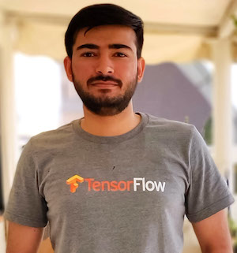

# About me

 

::: {.grid}
::: {.g-col-12  .g-col-sm-12 .g-col-md-4 #about-me-text}

:::

::: {.g-col-12  .g-col-sm-12 .g-col-md-8}

I am **Aakash Kumar Nain**, a Senior Machine Learning Engineer (Research) at Emergence AI, bringing over 8 years of experience in building and deploying advanced deep neural networks. A strong advocate for open-source development, I actively contribute to the machine learning ecosystem: I am a core collaborator on Keras 3.0, contribute within the JAX ecosystem, and maintain the TensorFlow-addons package. My expertise and contributions across the TensorFlow, Keras, and JAX frameworks led to my recognition as a Google Developers Expert (GDE).

My current work focuses on developing Large Language Models (LLMs) and Multimodal Large Language Models(MLLMs). Building these models has led me to focus my research on:

* Identifying and mitigating bottlenecks in multimodal architectures.
* Investigating the reasoning capabilities and limitations of large language models.
* Self-play and self-improvement in Large Language Models
* Diffusion models but for everything including discrete data (text).

Follow me on [X](https://x.com/A_K_Nain) to get latest updates on trends in Machine Learning and Artificial Intelligence.
:::
:::

# Publications

::: {.grid}
::: {.g-col-12  .g-col-sm-12 .g-col-md-12}
## Transformer Layers as Painters (AAAI 2025)
This work investigates the flow of information within frozen, pretrained transformer models (both decoder-only and encoder-only architectures). Using a series of ablation experiments, we examined the functional roles and dependencies of individual layers, specifically probing whether all layers are necessary, if they exhibit redundancy (particularly middle layers), the impact of execution order on inference and task performance, and the potential for parallel execution (with and without looping).

## The Ungrounded Alignment (CogSci 2025)
Though the current ML systems have advanced a lot, a key question remains unanswered: *How can we build in predefined knowledge in a system where we don't know how a given stimulus will be grounded?* We investigate this as the **Ungrounded Alignment Problem**. This work examines a specific instance: an unsupervised learner processes image sequences representing characters from a text corpus (using an unknown font or permutation). The learner receives no labels but is evaluated on recognizing key sequential patterns, forcing it to deduce the mapping between the variable visual inputs and the correct underlying character classes.
:::
:::

# Portfolio

::: {.grid}
::: {.g-col-12  .g-col-sm-12 .g-col-md-12}
## Popular Projects

[Annotated Research Papers](https://github.com/AakashKumarNain/annotated_research_papers) &nbsp; 

Most researchers and Machine Learning engineers want to remain up-to-date with the latest research
work, but the field of machine learning moves crazy fast. The number of papers uploaded on
[arXiv](https://arxiv.org/) is witnessing exponential growth. Reading all these published papers is
an impossible task. To help with this, I maintain this repository where I annotate and upload the
papers that I find exceptionally good. Annotations make it easier to understand and grasp the main
concepts explained in the paper.   

[TF-JAX Tutorials](https://github.com/AakashKumarNain/TF_JAX_tutorials) &nbsp; 

It is a series of tutorials built to teach the fundamental concepts and the underlying working of
two famous libraries: TensorFlow and JAX. These tutorials aren't typical documentation-type tutorials.
It doesn't matter whether you are a beginner or an advanced user, these tutorials will give you a fresh
perspective on building things using TensorFlow or JAX.  

[Diffusion Models](https://github.com/AakashKumarNain/diffusion_models) &nbsp; 

Diffusion models are a class of likelihood-based generative models that recently have been used
to produce very high-quality images compared to other existing generative models like GANs. It's
hard to find quality resources to learn about diffusion models. The mathematics behind the diffusion
models is also a bit harder to understand. The material presented in this repo is enough to make you
understand the working of diffusion models and the underlying math.  

[Mistral-7B in JAX](https://github.com/AakashKumarNain/mistral_jax) &nbsp; 

This is a direct port of Mitral-7B model in JAX and Equinox. This port comes with two implementations:
The first one shows how to port models from PyTorch to Equinox and JAX. This is a 1:1 mapping, and not
fully optimized. The second implementation is fully optimized for JAX, targeted for more advanced users.

:::

::: {.g-col-12  .g-col-sm-12 .g-col-md-6}
## [Keras Core Contributions](https://keras.io/keras_core/announcement/)

1. JAX NN ops
2. Merging layers
3. Metrics
4. Loss functions
5. Applications
6. Data adapters
7. Code examples
:::

::: {.g-col-12  .g-col-sm-12 .g-col-md-6}
## Keras Contributions

1. [Denoising Diffusion Models](https://keras.io/examples/generative/ddpm/)
2. [OCR model for reading captchas](https://keras.io/examples/vision/captcha_ocr/)
3. [Handwriting recognition](https://keras.io/examples/vision/handwriting_recognition/)
4. [Image captioning](https://keras.io/examples/vision/image_captioning/)
5. [WGAN-GP](https://keras.io/examples/generative/wgan_gp/)
6. [CycleGAN](https://keras.io/examples/generative/cyclegan/)
7. [Model interpretability with Integrated Gradients](https://keras.io/examples/vision/integrated_gradients/)
:::

::: {.g-col-12  .g-col-sm-12 .g-col-md-6}
## Equinox Contributions

1. [Mistral-7B implementation](https://docs.kidger.site/equinox/examples/mistral_7b/)
2. [Bug fix in RMSNorm Layer](https://github.com/patrick-kidger/equinox/pull/723)
3. [AMP in Normalization Layers](https://github.com/patrick-kidger/equinox/pull/876y)
:::

::: {.g-col-12  .g-col-sm-12 .g-col-md-6}
## TensorFlow Contributions

1. [Kappa](https://github.com/tensorflow/addons/blob/master/tensorflow_addons/metrics/cohens_kappa.py)
2. [Gelu activation](https://github.com/tensorflow/addons/blob/master/tensorflow_addons/layers/gelu.py)
3. [Focal loss](https://github.com/tensorflow/addons/blob/master/tensorflow_addons/losses/focal_loss.py)
4. [Thresholded Linear Unit](https://github.com/tensorflow/addons/blob/master/tensorflow_addons/layers/tlu.py)
:::
:::
