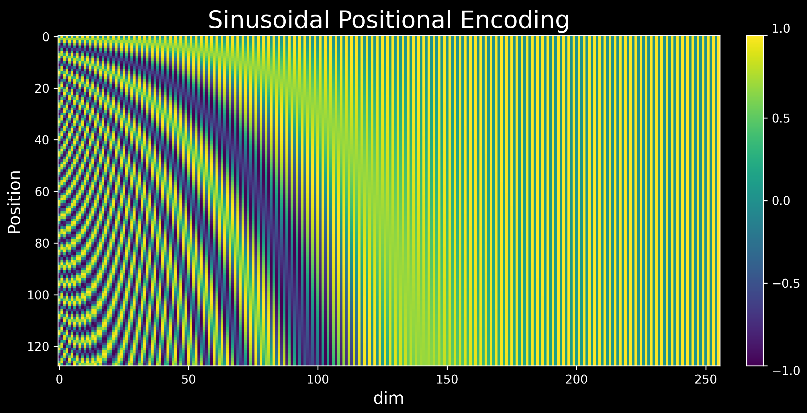
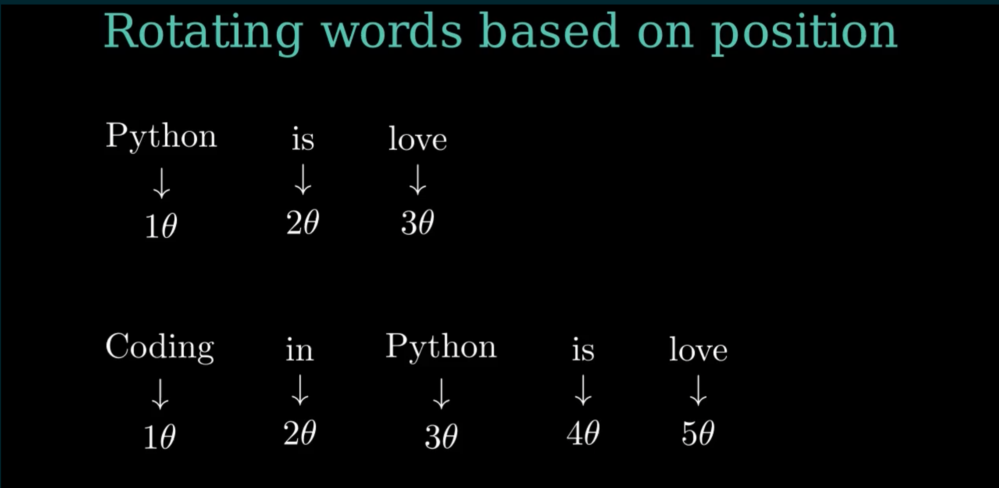

# Why bother with position encoding?

Self-attention in transformer-based models is one of the most used operations in the history of deep
learning. Though self-attention is extremely powerful, one of the weaknesses of self-attention is that
it treats a sequence as a set of tokens. It is not position-aware, and it is permutation equivariant. 

The order of words in a language matters; hence, we need a mechanism to insert word order information
in our model. This is where position encoding kicks in.

# Preliminary

Let $S_N=\{w_j\}^N_{j=1}$ be a sequence of $N$ input tokens with $w_j$ being the jth token. Each
token (word in this case) in the sequence is defined by a $d$-dimensional vector embedding $x_j$ containing no position information. The self-attention layer first incorporates position information into the token embeddings and then transforms them into queries, keys, and value representations. We can define these transforms as shown below:

$$
\begin{align}
    & q_m = f_q(x_m, m) \\
    & k_n = f_k(x_n, n) \tag{1} \\ 
    & v_n = f_v(x_n, n) 
\end{align}
$$

| where:
|       $q \ \rightarrow$  represents the query vector
|       $k \ \rightarrow$  represents the key vector
|       $v \ \rightarrow$  represents the value vector
|       $m \rightarrow$  represents the $mth$ position
|       $n \ \rightarrow$  represents the $nth$ positions
|       $x \ \rightarrow$  represents the token (word) embedding without any position encoding
|       $f \ \rightarrow$  represents the transformation applied to the token embedding to transform
|                   it into query, key or value vector  

Unless otherwise stated, we will use the above notations throughout this blog post.

# Desired properties of a position encoding

If we encode positions for the model, what would be the ideal design? The simplest thing we can do is
initialize a learnable position embedding and let the model figure out the values during training. Not a
bad idea for starters, but can we do better? What are the desirable properties of an encoding scheme if it
is not learned implicitly? Here are a few of them:

1. **A unique value for every position in a sequence:** The encoding scheme should assign a unique value
for every position irrespective of the sequence length.   
2. **Consistent relative distance between two positions:** Irrespective of the length of a sequence, the
relative distance between two positions should be consistent across sequences. For example, the relative
distance between encodings of the 2nd position and 3rd position should be the same in sequences of
different lengths.   
3. **Long-term decay:** An inductive bias about words is that words far distant from the current word
carry less relevant information. That means our position encoding should follow a long-term decay effect
for relatively distant positions.   
4. **Extensible:** What if we encounter a lengthier sequence at test time than the length of any sequence
encountered during training? Ideally, we want our encoding scheme to be extensible, without much effort
and without breaking any other assumption.   
5. **Deterministic:** Determinism is mostly a nice-to-have property. It can help debug a few aspects if
we encounter something unexpected.

There are different encoding schemes, e.g., absolute position encoding, binary encoding, relative
position encoding, rotary position encoding, etc. Here, we will discuss the two most widely used position
encodings: sinusoidal position encoding and rotary position encoding. We could have skipped sinusoidal position encoding as well, but it lays the foundation of rotary position encoding. Also, we will try to keep the notations in line with the [RoFormer](https://arxiv.org/abs/2104.09864) paper as much as possible.  

# Sinusoidal Positional Encoding

A typical choice for equation(1) is to formulate it this way:
$$
f_t(x_j, j) = W_t(x_j + p_j) \tag{2} \\
$$

where $t \in (q, k, v)$, and $p_j$ is a $d$ dimensional position vector depending of the position of
token $x_j$. Simply put, we encode the position and add it to the token embedding.

Sinusoidal encoding was proposed in the paper [Attention is All You Need](https://arxiv.org/abs/1706.03762). They proposed to generate $p_j$ in the above equation using the sinusoidal function:
$$
\begin{cases}
p_{pos,2i} &= \sin(pos/(10000^{2i/d})) \\
p_{pos,2i+1} &= \cos(pos/(10000^{2i/d})) \\ \tag{3}
\end{cases}
$$

where $pos$ is the position and $i$ is the dimension. That is, each dimension of the positional encoding corresponds to a sinusoid. The wavelengths form a geometric progression from $2π$ to $10000·2π$.
Here is a sample visualization of sinusoidal positional encoding. There are 128 rows representing 128 positions, and each encoded position is a 256-dimensional vector (represented by columns).

Many people do not know sinusoidal encoding was proposed so the model can learn to attend to relative
positions. Yes, relative positions! This is mostly because people do not read papers with "attention".
Let us take an example with $d=2$ to prove it. 

Calculate the sinusoidal positional encodings for $position=pos$ using equation 3:

$$
\begin{align*}
    PE_{pos,0} &= \sin(pos/(10000^{2*0/d})) = sin(pos) \\
    PE_{pos,1} &= \cos(pos/(10000^{2*0/d})) = cos(pos) \\
\end{align*}
$$

Similarly, let us calculate the sinusoidal positional encodings for an offset $k$ i.e., $position=pos+k$:

$$
\begin{align*}
    PE_{pos+k, 0} &= \sin((pos+k)/(10000^{2*0/d})) = \sin(pos+k) \\
    PE_{pos+k, 1} &= \cos((pos+k)/(10000^{2*0/d})) = \cos(pos+k) \\
\end{align*}
$$

 Using trigonometric identities, we can expand $sin(pos+k)$ and $cos(pos+k)$ as:

$$
\begin{align*}
    \sin(pos+k) &= \sin(pos)\cos(k) + \cos(pos)\sin(k) \\
                &= PE_{pos, 0} \cos(k) + PE_{pos, 1} \sin(k) \tag{4} \\ \\
    \cos(pos+k) &= \cos(pos)\cos(k) - \sin(pos)\sin(k) \\
                &= PE_{pos, 1} \cos(k) - PE_{pos, 0} \sin(k) \tag{5} \\
\end{align*}
$$

We can combine equation (4) and equation (5) in a nice matrix notation:

$$
\begin{align*}
\begin{bmatrix}
    PE_{pos+k,0} \\
    PE_{pos+k,1}
\end{bmatrix} &= 
\underbrace{\begin{bmatrix}
    \cos(k)  & \sin(k) \\ 
    -\sin(k) & \cos(k)
\end{bmatrix}
}_{Rotation \ Matrix}
\begin{bmatrix}
    PE_{pos,0} \\
    PE_{pos,1}
\end{bmatrix}
\end{align*}
$$

That's a transposed rotation matrix! So, our models *might* have been learning to attend relative positions since 2017 because for any fixed offset $k, \ PE_{pos+k}$ can be represented as a linear function of $PE_{pos}$. If that is the case, what is wrong with sinusoidal positional encoding? A few things...

Take a look at the visualization below. We have a two-dimensional vector $x=[1, 1]$, and we add
sinusoidal positional encoding for different positions to this vector.

{autoplay=true, loop=true}

Though we assume that the model can attend to relative positions easily, the pattern generated here, as noted in the above visualization, is jagged. This doesn't necessarily mean it is also bad for the model to learn, especially at scale. All we can say is that it is chaotic across different dimensions, the model *may* have a hard time learning to attend to relative positions.

Another thing to note from equation (2) is that sinusoidal positional encodings are additive. A side effect of this is that two highly related tokens can get high attention scores irrespective of the distance between them. This is still okay for NLP-related problems but doesn't hold for other domains like protein sequencing.

The authors of the **Attention is All You Need** paper also hypothesized that hard-coded sinusoidal
positional encodings may help to extrapolate to longer sequences compared to the length of the
sequences seen during training. The hypothesis does not hold in practice (PPL goes crazy!).

# Rotary Position Encoding: The Easy Way

From the above discussion, two things are clear:

1. Encoding relative positions is crucial for attention, but additive methods like sinusoidal encodings
are not the best way to do it.
2. Incorporating a rotation matrix in some form is a good choice for encoding relative positions.

RoPE leverages the above findings. It rotates an encoded vector by some angle $\theta$ based on its position in a sequence. Suppose *Python* is the query token, *love* is the key token, and we want to compute attention scores between them in two different sequences
as given below:

* Python is love
* Coding in Python is love

This is how the tokens will be rotated in each of the two sequences:

Is it any good? The relative distance between our query token *Python* and the key token *love* is $2\theta$ in both sequences. One interesting aspect is that the number of tokens occurring after the query token (*Python* in this case) does not affect the embedding. The amount of rotation is purely dependent on the token's position in the sequence. The inner product between the query and the key vectors ($q^Tk$) remains the same in both sequences. For a 2D case, if we generalize the rotation used in RoPE, we can rewrite our rotation matrix as follows:

$$
\begin{align*}
    R_\Theta^p =
    \begin{bmatrix}
    \cos(p\theta)  & -\sin(p\theta) \\ 
    \sin(p\theta) & \cos(p\theta) \tag{6}
    \end{bmatrix}
\end{align*}
$$

where $p$ is the token's position in a sequence. Let us revisit equation(1) now:

$$
\begin{align*}
    & q_m = f_q(x_m, m) \\
    & k_n = f_k(x_n, n)  \\ 
    & v_n = f_v(x_n, n) 
\end{align*}
$$

The inner product of query and key vectors $q^T_mk_n$ in the attention mechanism computes a relevance score between tokens. We are interested in finding a transformation "$g$" with the hope that the inner product between query and key encodes position information only in the relative form as shown below. Pay attention; function $g$ depends only on the token embeddings and the relative distance ($m-n$) between them without any information about the absolute value of the positions $m$ and $n$.

$$
\begin{align*}
\langle f_q(\boldsymbol{x}_m, m), f_k(\boldsymbol{x}_n, n)\rangle = g(\boldsymbol{x}_m, \boldsymbol{x}_n, m-n).
\end{align*}
$$

Let us check how RoPE fulfills this criteria. Note that $m$ and $n$ represents the $mth$ and $nth$
positions respectively. Also, here $q$ and $k$ represent a single query and a single key. Do not
get confused by the notation.

$$
\begin{align*}
    q_m &= f_q(x_m, m) = R_\Theta^m \ W_q x_m \\
    k_n &= f_k(x_n, n) = R_\Theta^n \ W_k x_n \\ \\
    q_m^T \ k_n &= x_m^T W_q^T \ (R_\Theta^m)^T \ \ R_\Theta^n \ W_k x_n \\
              &= x_m^T W_q^T \ R_\Theta^{-m}  \ \   R_\Theta^n \ W_k x_n \quad 
                    \text{(Transpose of a rotation matrix is its inverse)} \\
              &= x_m^T W_q^T \ R_\Theta^{n-m} \ W_k x_n \\
\end{align*}
$$

So, RoPE is encoding the relative position information in the attention calculation, which we wanted.
Remember the point we made about jaggedness in sinusoidal encodings? Does RoPE fare better in that
aspect? Here is how our vector moves in 2D if we use RoPE instead of sinusoidal encodings: 

{autoplay=true, loop=true}

We looked only at a 2D case, but we would want to generalize this for $d$ dimensions with $d > 2$. Before doing that, let us look at it from another perspective, similar to what was presented in the RoFormer paper. 

# Rotary Position Encoding: The Mathematical View

We are looking for something that can encode relative positions in the attention mechanism, and it
should not be an additive method like sinusoidal position encoding. Mathematics provides the solution to all our problems! We will exploit the geometrical properties of vectors, especially the complex form and polar form of vectors. But why the complex form? We will get an answer to that question once we have finished our quest to find the desired transformation $g$.

A complex number $z$ can be represented in the form:
$$
\begin{align*}
z = a + ib
\end{align*}
$$

where $a$ denotes the real part, and $b$ denotes the imaginary part. These are also denoted as $Re(z) = a$ and $Im(z) = b$ in the literature. $i=\sqrt{-1}$ is a complex number called as `iota` The polar form of $z$ is given as:

$$
\begin{align*}
z = re^{i\theta}
\end{align*}
$$

where $r$ is the magnitude, and $\theta$ is the angle it makes with the positive x-axis. Also, using Euler's formula, we can write:

$$
\begin{align*}
u = e^{i\theta} = \cos(\theta) + i\sin(\theta)
\end{align*}
$$

$u$ is a unit complex number. An interesting property of $u$ is that multiplying any complex number by $u$
will rotate that number by an angle $\theta$ counterclockwise around the origin i.e.,

$$
\begin{align*}
z' = z \cdot u
\end{align*}
$$

More generally, if we have a complex number in the form as $z = re^{i\phi}$ (where 
$r$ is the magnitude and $\phi$ is the angle), multiplying it by another unit complex number $u = e^{i\theta}$ results in a rotated complex number as:

$$
\begin{align*}
z' = re^{i(\phi + \theta)}
\end{align*}
$$

The multiplication of complex numbers serves as an elegant method for performing rotations. With the above refresher on complex numbers, let us derive rotary positional encodings for $d=2$. Suppose we have two word embedding vectors $x_q$ and $x_k$, corresponding to query and key with their positions represented by $m$ and $n$ respectively. With the help of equation (1), we can write their position-encoded counterparts as:

$$
\begin{align*}
q_m &= f_q(\boldsymbol{x}_q, m) = R_q(\boldsymbol{x}_q, m) \ e^{i\Theta_q(\boldsymbol{x}_q,m)} \\
k_n &= f_k(\boldsymbol{x}_k, n) = R_k(\boldsymbol{x}_k, n) \ e^{i\Theta_k(\boldsymbol{x}_k,n)} \tag{7}
\end{align*}
$$

Assuming there exists a transformation $g$ shown below capable of encoding relative position, we aim to
find a solution of $f_q$ and $f_k$

$$
\begin{align*}
g(\boldsymbol{x}_m, \boldsymbol{x}_n, m-n) &= \langle f_q(\boldsymbol{x}_m, m), f_k(\boldsymbol{x}_n, n)\rangle \\
    &=  \langle R_q(\boldsymbol{x}_q, m) \ e^{i\Theta_q(\boldsymbol{x}_q, \ m)},
        R_k(\boldsymbol{x}_k, n) \ e^{i\Theta_k(\boldsymbol{x}_k,\ n)} \rangle \\
    &=  R_g(\boldsymbol{x}_q, \boldsymbol{x}_k, n-m) \ 
        e^{i\Theta_g(\boldsymbol{x}_q, \ \boldsymbol{x}_k, \ n-m)} \tag{8} \\ \\
\end{align*}
$$

where $R$ and $\Theta$ represents radial and angular components respectively. Plugging them in equation (7), gives us:

$$
\begin{align*}
R_q(\boldsymbol{x}_q, m)R_k(\boldsymbol{x}_k, n) &= R_g(\boldsymbol{x}_q, \boldsymbol{x}_k, n-m) \\
\Theta_k(\boldsymbol{x}_k, n) - \Theta_q(\boldsymbol{x}_q, m) &= \Theta_g(\boldsymbol{x}_q, \boldsymbol{x}_k, n-m) \tag{9}
\end{align*}
$$

When no positional information is provided, we expect the following conditions to be satisfied:

$$
\begin{align*}
    \boldsymbol{q} &= \|q\|e^{i\theta_q} = f_q(\boldsymbol{x}_q, 0) = R_q(\boldsymbol{x}_q,0)e^{i\Theta_q(\boldsymbol{x}_q,0)} \\
    \boldsymbol{k} &= \|k\|e^{i\theta_k} = f_q(\boldsymbol{x}_k, 0) = R_k(\boldsymbol{x}_k,0)e^{i\Theta_k(\boldsymbol{x}_k,0)} \tag{10}
\end{align*}
$$

When $m=n$, we have:

$$
\begin{align*}
    R_q(\boldsymbol{x}_q, m)R_k(\boldsymbol{x}_k, m) &= R_g(\boldsymbol{x}_q, \boldsymbol{x}_k, 0)  \qquad \text{(using eq. 8)} \\
    &= R_q(\boldsymbol{x}_q, 0)R_k(\boldsymbol{x}_k, 0) \\
    & = \|q\|\|k\| \tag{11a} \\
    \Theta_k(\boldsymbol{x}_k, m) - \Theta_q(\boldsymbol{x}_q, m) &= \Theta_g(\boldsymbol{x}_q, \boldsymbol{x}_k, 0) \\
    &= \Theta_k(\boldsymbol{x}_k, 0) - \Theta_q(\boldsymbol{x}_q, 0) \\
    &= \theta_k - \theta_q \tag{11b}
\end{align*}
$$

 From equation $(11a)$, we have
$R_g(\boldsymbol{x}_q, \boldsymbol{x}_k, n-m) = R_g(\boldsymbol{x}_q, \boldsymbol{x}_k, 0) = \|q\|\|k\|$
implying that all radial components $R_g, R_q, R_k$ are independent from the position information. 

Similarly, from equation $(11b)$, we have
$\Theta_q(\boldsymbol{x}_q, m) - \theta_q = \Theta_k(\boldsymbol{x}_k, m) - \theta_k \text{ for all } q, k, m$,
which indicates that the angular components do not dependent on the query and the key vectors, and
depends only on the position $m$. We can simply this by rewriting the above equation:

$$
\begin{align*}
    \Theta_q(\boldsymbol{x}_q, m) - \theta_q &= \Theta_k(\boldsymbol{x}_k, m) - \theta_k \\
    \Theta_q(\boldsymbol{x}_q, m) - \Theta_k(\boldsymbol{x}_k, m) &= \theta_q - \theta_k \\
    \Theta_f(\boldsymbol{x}_{\{q, k\}}, m) - \theta_{\{q, k\}} &= \phi(m) \tag{12}
\end{align*}
$$

 Suppose we have $n=m+1$, plugging this in equation (9), and using equation (12), we get:

$$
\phi(m+1) - \phi(m) = \Theta_g(\boldsymbol{x}_q, \boldsymbol{x}_k, 1) + \theta_q - \theta_k
$$

 Since RHS in the above equation is a constant and does not depend on $m$, with continuous integer
inputs, it produces an arithmetic progression that can be written as:

$$
\phi(m) = m\theta + \gamma \tag{13}
$$

where $\theta, \gamma \in \mathbb{R}$ are constants and $\theta$ is non-zero. We can simply
set $\gamma=0$.

Therefore, for a 2D case, we can write $f_q$ and $f_k$ as:

$$
\begin{align*}
f_q(\boldsymbol{x}_m, m) &= (W_q\boldsymbol{x}_m)e^{im\theta} \\
f_k(\boldsymbol{x}_n, n) &= (W_k\boldsymbol{x}_n)e^{in\theta} \\
g(\boldsymbol{x}_m, \boldsymbol{x}_n, m-n) &= Re[(W_q\boldsymbol{x}_m)(W_k\boldsymbol{x}_n)^*e^{i(m-n)\theta}]
\end{align*}
$$

where $Re[·]$ is the real part of a complex number and $(W_k x_n)^*$ represents the conjugate complex
number of $(W_k x_n)$. We can further write $f_{\{q, k\}}$  in the form of matrix multiplication as:

$$
\begin{align*}
    f_{\{q,k\}}(\boldsymbol{x}_m, m) = 
    \begin{pmatrix}
        \cos m\theta & -\sin m\theta \\
        \sin m\theta & \cos m\theta
    \end{pmatrix}
    \begin{pmatrix}
        W_{\{q,k\}}^{(11)} & W_{\{q,k\}}^{(12)} \\
        W_{\{q,k\}}^{(21)} & W_{\{q,k\}}^{(22)}
    \end{pmatrix}
    \begin{pmatrix}
        x_m^{(1)} \\
        x_m^{(2)}
    \end{pmatrix}  \tag{13}
\end{align*}
$$

Representing the vectors in their complex form helps us formulate the maths of it in a much simpler way.

# Beyond 2D

Generalizing our 2D results to $d$ dimensions is easy. If our embeddings are d-dimensional
($d>2$, and d is even), we can split them into $d/2$ blocks, and for each block, we can repeat the same
thing we have for the 2D case. That way, we will end up with a diagonal rotation matrix, where the value
of $\theta$ differs for each dimension. We can then apply the rotation matrix to each block independently
and combine the results afterward. The rotation speed varies across the blocks. 

$$f_{\{q,k\}}(x_m,m) = \boldsymbol{R}^d_{\Theta,m}\boldsymbol{W}_{\{q,k\}}x_m \tag{14}$$

where

$$
\boldsymbol{R}^d_{\Theta,m} = 
        \begin{pmatrix}
            \cos m\theta_1 & -\sin m\theta_1 & 0 & 0 & \cdots & 0 & 0 \\
            \sin m\theta_1 & \cos m\theta_1 & 0 & 0 & \cdots & 0 & 0 \\
            0 & 0 & \cos m\theta_2 & -\sin m\theta_2 & \cdots & 0 & 0 \\
            0 & 0 & \sin m\theta_2 & \cos m\theta_2 & \cdots & 0 & 0 \\
            \vdots & \vdots & \vdots & \vdots & \ddots & \vdots & \vdots \\
            0 & 0 & 0 & 0 & \cdots & \cos m\theta_{d/2} & -\sin m\theta_{d/2} \\
            0 & 0 & 0 & 0 & \cdots & \sin m\theta_{d/2} & \cos m\theta_{d/2}
\end{pmatrix}  \tag{15}
$$

 RoPE is then applied to the query and key vectors for attention calculation as:

$$
\boldsymbol{q}_m^\top \boldsymbol{k}_n =
(\boldsymbol{R}_{\Theta,m}^d \boldsymbol{W}_q \boldsymbol{x}_m)^\top (\boldsymbol{R}_{\Theta,n}^d \boldsymbol{W}_k \boldsymbol{x}_n)
= \boldsymbol{x}_m^\top \boldsymbol{W}_q^\top \boldsymbol{R}_{\Theta,n-m}^d \boldsymbol{W}_k \boldsymbol{x}_n
\tag{16}
$$

 Here is an example with $d=4$. The query vector is split into blocks of size two, and rotation is applied to each group independently. Notice the difference in the speed of the two pointers shown below.

{autoplay=true, loop=true}

 A recent [paper](https://arxiv.org/abs/2410.06205) from DeepMind found some interesting aspects about
these frequencies. For example, in the case of Gemma-7B, these high frequencies are responsible for the
*diagonal head* and the *previous token head* in some layers.

{width=750}

 On the other hand, the low frequencies are not very sensitive to the relative distance. It helps the
transformers to maintain *semantic attention* over a large context. This is why models with very long
context windows use a very high value for the base frequency $(\theta)$ in practice. For example,
with a context length of 128K, LLama 3 uses a base frequency of 500,000 leading the low frequencies to
rotate at roughly $1/500,000$ radians per token.

# Optimization

There is one major problem with equation (16). Our rotation matrix is sparse, and though sparsity is good
in many places, it is not in this case. We are wasting memory because of that sparsity. Another issue is
that equation (16) is not computationally efficient. 

We can fix both the issue with a bit of cleverness. Taking advantage of that sparsity along with
elementwise operations, we can compute the same thing more efficiently, as shown below:

$$
\boldsymbol{R}^d_{\Theta,m} \boldsymbol{x} =
\begin{pmatrix}
    x_1 \\ x_2 \\ x_3 \\ x_4 \\ \vdots \\ x_{d-1} \\ x_d
\end{pmatrix}
\otimes
\begin{pmatrix}
    \cos m\theta_1 \\ \cos m\theta_1 \\ \cos m\theta_2 \\ \cos m\theta_2 \\ \vdots \\ \cos m\theta_{d/2} \\ \cos m\theta_{d/2}
\end{pmatrix}
+
\begin{pmatrix}
    -x_2 \\ x_1 \\ -x_4 \\ x_3 \\ \vdots \\ -x_d \\ x_{d-1}
\end{pmatrix}
\otimes
\begin{pmatrix}
    \sin m\theta_1 \\ \sin m\theta_1 \\ \sin m\theta_2 \\ \sin m\theta_2 \\ \vdots \\ \sin m\theta_{d/2} \\ \sin m\theta_{d/2}
\end{pmatrix} 
\tag{17}
$$

 

# What else?

1. **Is RoPE all we need?** Though RoPE seems the perfect encoding, it is far from ideal.
For example, the idea of long-term decay does not hold in many situations with RoPE.
2. **What about other options like NoPE, HoPE, etc?** None of these encodings is a clear winner in every
case. In many situations, sinusoidal is more than sufficient. The advantage of using RoPE is that it is
a solid baseline over others.
3. **Does RoPE work well for other modalities?** People like to slap RoPE in every possible situation.
Have you ever wondered how RoPE behaves with image tokens? You may find a thing or two in there.
4. **What about extending the context length?** We will talk about it in the next part

 *Special thanks to my colleague Marc Pickett, and my friends Aritra and Abheesht for their valuable feedback.* 

# References

* [Attention Is All You Need](https://arxiv.org/abs/1706.03762)
* [Roformer](https://arxiv.org/abs/2104.09864)
* [Round and Round We Go!](https://arxiv.org/abs/2410.06205)
* [Rotary Embeddings: A Relative Revolution](https://blog.eleuther.ai/rotary-embeddings/)
* [RoPE explained](https://www.youtube.com/watch?v=GQPOtyITy54)
* [How Rotary Position Embedding Supercharges Modern LLMs](https://www.youtube.com/watch?v=SMBkImDWOyQ)
* [Manim examples](https://docs.manim.community/en/stable/examples.html)
