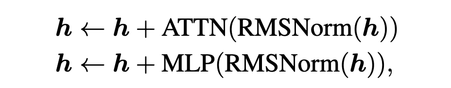
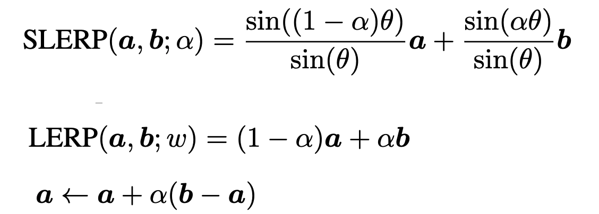
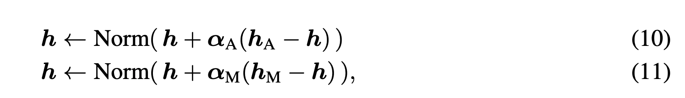

We have been using transformers daily for a couple of years now, but the advancements on the architectural side have remained minimal. This paper from Nvidia proposes a **normalized Transformer (nGPT)**, which performs representation learning on a hypersphere. Here is a summary for the same:

# Token embeddings and output logits

1. Both input and output embedding matrices are normalized after each training step.
2. The logits are bounded in the range [-1, 1] because of the normalization, which limits the confidence of the probability distribution generated by the softmax.
3. To adjust this during training, the authors introduce a trainable scaling parameter *sz* that scales the logits element-wise.

# Layers and Blocks

1. A typical transformer block looks like this where L layers of transformations are applied to the hidden state h, consisting of alternating the self-attention and MLP blocks:  

  
2. If we are on a hypersphere, we can use spherical linear interpolation to compute the geodesic distance between two points a and b on the hypersphere. We can approximate SLERP with approximate linear interpolation (LERP) as shown below:   

  
3. If point a is our hidden state h, and point b represents the point suggested by the attention or MLP block, we can represent our equations for the transformer blocks like this:   

  
4. Here α~A~ ≥0 and α~M~ ≥0, with dimensionality d~model~, are learnable parameters applied to the normalized outputs of the attention and MLP blocks, respectively. The norm function normalizes any vector x to have a unit norm and, unlike RMSNorm or LayerNorm, does not introduce any element-wise scaling factors. This normalization can be viewed as the retraction step in Riemannian optimization, mapping the updated solution back to the manifold.

# Self-Attention Blocks
1. The qkv values produced by the weight matrics W~q~, W~k~, and W~v~ in the original transformer are unconstrained, leading to unbounded values in *q*.

2. In nGPT the authors normalize W~q~, W~k~, W~v~ and W~o~ along their embedding dimension so that the computed dot products with h can be interpreted as cosine similarity between unit norm vectors bounded in [−1, 1]. Thus, all attention matrices can be viewed as collections of normalized embedding vectors to be compared.

3. Though each element of *q* and *k* is now bounded, the norms of these two vectors can still vary. Also, the addition of positional embeddings can further distort *q* and *k*. To this end, the authors additionally normalize *q* and *k* by introducing a scaling factor s~qk~ for each head, ensuring that the dot product of every query and key is under control.

4. In the original Transformer, the query-key dot product is scaled by 1/√d_k before applying softmax to account for the expected variance of d~k~ in the dot product of non-normalized query and key vectors. In the normalized Transformer, the expected variance of the dot product between the normalized query and key vectors is 1/dk. The softmax scaling factor should instead be √d_k to restore a variance of 1

# MLP
1. The input hidden state *h* of the MLP block of a classical transformer is first normalized using RMSNorm(or LayerNorm) and then passed through two separate linear projections, producing two intermediate vectors *u* and *v*, which are then combined using SwiGLU.

2. The weight matrices W~u~ and W~v~ in nGPT are normalized. The authors introduce scaling factors s~u~ and s~ν~ to control their impact. They also rescale ν by √d_model to optimize SiLU performance.

# Summary of all modifications
1. Remove all normalization layers like RMSNorm or LayerNorm.

2. After each training step, normalize all matrices (E~input~, E~output~, W~q~, W~k~, W~v~, W~o~, W~u~, W~ν~, and W~o~) along their embedding dimension.

3. Replace the updates as follows where α~A~ (and also α~M~) is treated with α~A,init~ = 0.05 (in order of 1/n_layers) and α~A,scale~ = 1/√d_model.

4. Change the softmax scaling factor in attention from 1/√d_k to √d_k.

5. Implement the rescaling and normalization of q and k where s~qk~ is treated with s~qk,init~ = 1 and s~qk,scale~ = 1/√d_model.

6. Implement the rescaling of the intermediate state of the MLP block where s~u~ (and also s~ν~) is treated with s~u,init~ = 1 and s~u,scale~ = 1

7. Implement the rescaling of logits using equation 3, where sz is treated with s~z,init~ = 1, s~z,scale~ = 1/√d_model.

8. Remove weight decay and learning rate warmup.