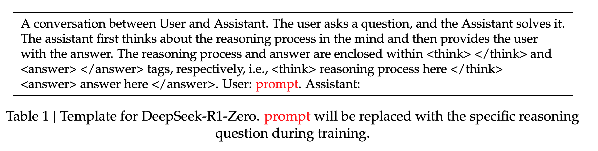
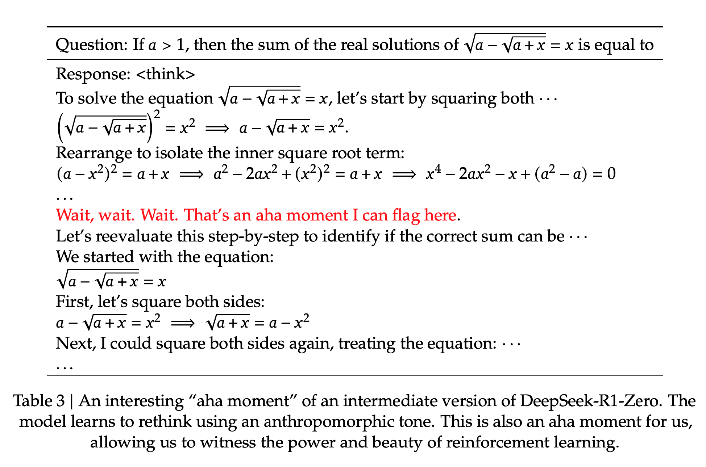
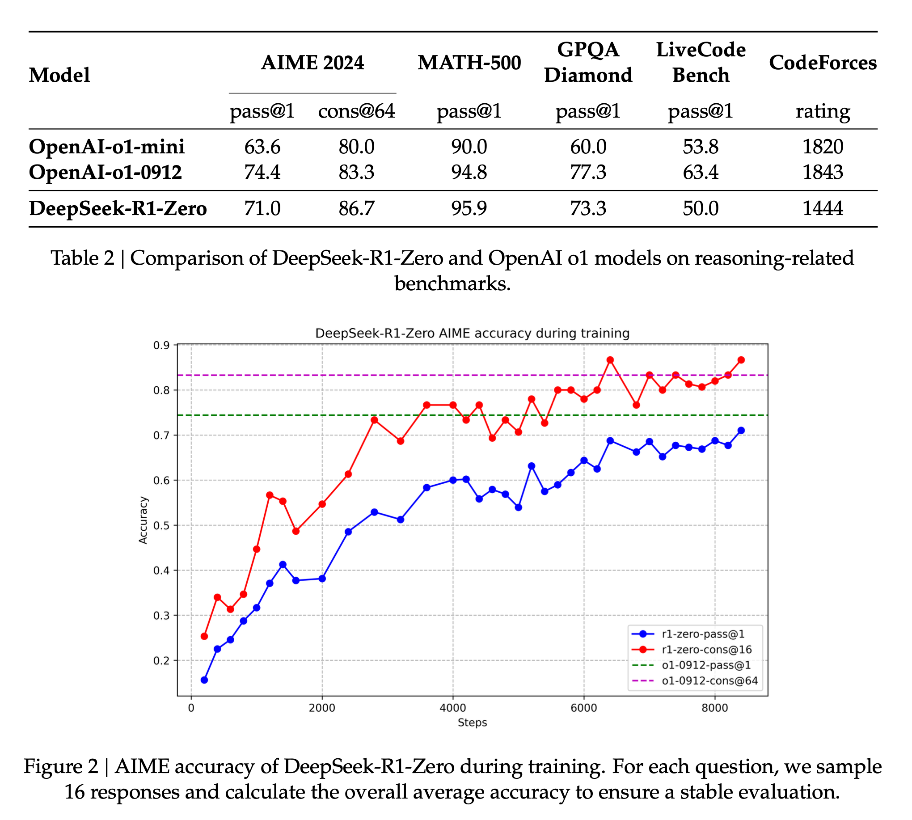
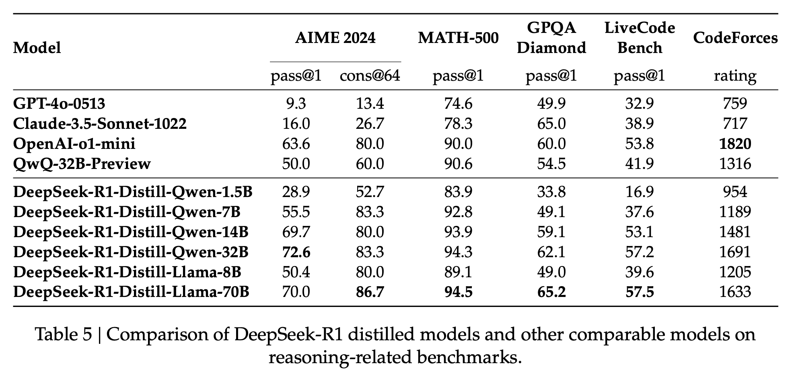
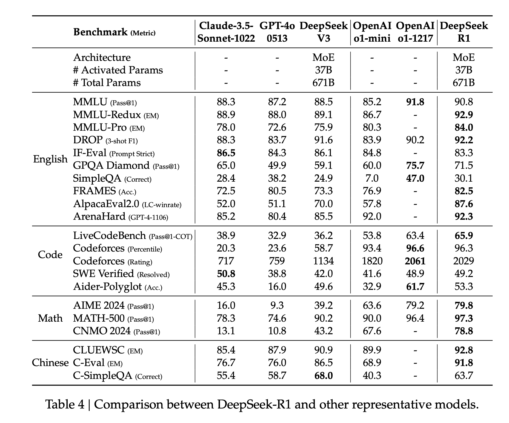
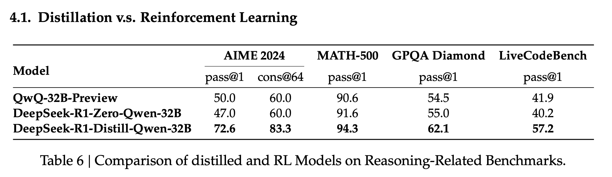

[Paper](https://github.com/deepseek-ai/DeepSeek-R1/blob/main/DeepSeek_R1.pdf2) 

# Approach

- Emphasize that RL can improve reasoning without using supervised fine-tuning as a cold start.
- Cold start can provide a performance boost but is optional.
- Applies RL directly to the base model without adding any SFT, resulting in the DeepSeek-R1-Zero model.
- Applies RL starting from a checkpoint fine-tuned with thousands of long CoT examples producing DeepSeek-R1.
- Distill reasoning capabilities from R1 to smaller dense models.

# DeepSeek-R1-Zero
- RL is applied to the base model without any supervised data.
- Uses Group Relative Policy Optimization(GRPO) instead of a critic model. For each question 𝑞, GRPO samples a group of outputs {𝑜1, 𝑜2,..., 𝑜𝐺} from the old policy 𝜋(𝜃)_𝑜𝑙𝑑 and then optimizes the policy model 𝜋(𝜃) by maximizing the following objective:
$$
\begin{align}
    \mathcal{J}_{GRPO}(\theta) &= \mathbb{E}\Big[q \sim P(Q), \{o_i\}_{i=1}^G \sim \pi_{\theta_{old}}(O|q)\Big] \\
    &\frac{1}{G}\sum_{i=1}^{G} \Big( \min\Big(\frac{\pi_\theta(o_i|q)}{\pi_{\theta_{old}}(o_i|q)}A_i, \text{clip}\Big(\frac{\pi_\theta(o_i|q)}{\pi_{\theta_{old}}(o_i|q)}, 1-\varepsilon, 1+\varepsilon\Big)A_i\Big) - \beta \mathbb{D}_{KL}(\pi_\theta || \pi_{ref}) \Big),  \\
    \mathbb{D}_{KL}(\pi_\theta || \pi_{ref}) &= \frac{\pi_{ref}(o_i|q)}{\pi_\theta(o_i|q)} - \log\frac{\pi_{ref}(o_i|q)}{\pi_\theta(o_i|q)} - 1
\end{align}
$$
where $\varepsilon$ and $\beta$ are hyper-parameters, and $A_i$ is the advantage, computed using a group of rewards $\{r_1, r_2, \dots, r_G\}$ corresponding to the outputs within each group:
$$
\begin{equation}
    A_i = \frac{r_i - \text{mean}(\{r_1, r_2, \dots, r_G\})}{\text{std}(\{r_1, r_2, \dots, r_G\})}.
\end{equation}
$$
- Two kinds of reward signals used in training: Accuracy rewards and format rewards. The accuracy reward model evaluates whether the response is correct, while the format reward forces the model to put its thinking process between <think> and </think> tags.
- To make the model adhere to instructions, the authors designed the following template that requires the model to produce a reasoning process first, followed by the final answer.
- The authors noticed an emergent behavior in the self-evolution process of the model with the increase in test-time computation because of the RL-first policy used in training. Behaviors such as reflection, where the model revisits and reevaluates its previous steps, and the exploration of alternative approaches to problem-solving arise spontaneously.
- The authors noticed an "aha moment" during the training occurs in an intermediate version of the model. During this phase, the model learns to allocate more thinking time to a problem by reevaluating its initial approach.
- Though DeepSeek-R1-Zero is a powerful reasoning model, it has a few drawbacks like poor readability and language mixing.

    
  
  

# DeepSeek-R1

- RL is applied with a cold start.
- The authors construct and collect a small amount of long CoT data to fine-tune the model as the initial RL actor. These are high-quality datasets.
- With a cold start, the authors try to address the drawbacks of the R1-Zero model. To improve readability, the authors design a readable pattern that includes a summary at the end of each response and filters out responses that are not reader-friendly when creating cold-start data for DeepSeek-R1.
- After fine-tuning DeepSeek-V3-Base on the cold start data, they apply the same large-scale RL training process of DeepSeek-R1-Zero.
- The authors observed language mixing problems during training and proposed a language consistency reward during RL training, calculated as the proportion of target language words in the CoT. The final reward is the sum of the accuracy of the reasoning tasks and the reward for language consistency.
- Once the RL training converged, they utilized the resulting checkpoint to collect SFT data for the subsequent round to improve other capabilities than reasoning.
- For reasoning data, they curate reasoning prompts and generate reasoning trajectories by performing rejection sampling from the checkpoint from the RL training, totaling around 600k reasoning-related training samples.
- For non-reasoning data, such as writing, factual QA, self-cognition, and translation, they adopt the DeepSeek-V3 pipeline and reuse portions of the SFT dataset of DeepSeek-V3.
- Once the SFT is finished, they do another round of RL training aimed at improving the model’s helpfulness and harmlessness while simultaneously refining its reasoning capabilities.

# Distillation to smaller models

- Fine-tuned  Qwen and Llama using the 800k samples curated with DeepSeek-R1.
- For distilled models, they only apply SFT and not RL
- Found that distilling more powerful models into smaller ones yields excellent results, whereas smaller models relying on the large-scale RL require enormous computational power and may not even achieve the performance of distillation.
    

# Additional Points

- No PRM or MCTS because too complex to implement during training.
- A model-based PRM leads to reward hacking and retraining the reward model needs additional training resources, and it complicates the whole training pipeline.
- For MCTS, the search is exponentially huge and poses problems when scaling models.
- DeepSeek-R1 is prompt sensitive, and Few-shot prompting consistently degrades its performance.

# Performance

Here is how R1 performed on the benchmarks compared to other models:
    

# Distillation vs RL

I have been saying this for years, but I will say it again today: If there is one thing that should be on your list for developing efficient yet performant models, it should be distillation. Distillation done well is all you need.
    
