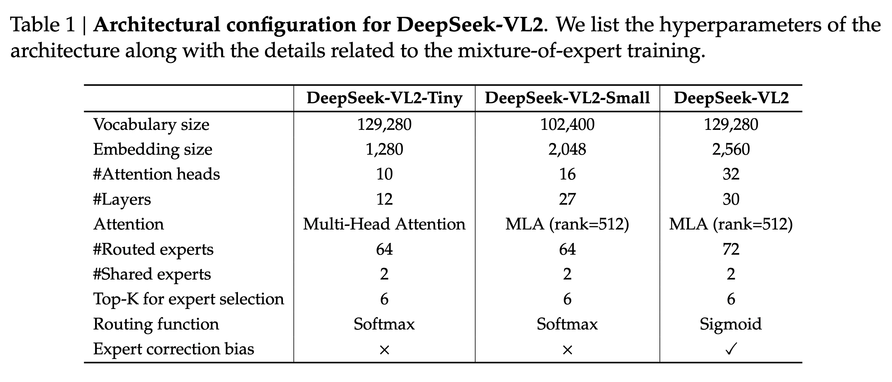

[arXiv](https://arxiv.org/abs/2412.10302) 

DeepSeek presents DeepSeek-VL2, a MOE VLM. It is mostly an incremental improvement over DeepSeek-VL, with a few better design choices inspired by the latest developments in the multimodal space.

    

# Model Architecture

Three components:

- Vision Encoder: SigLIP-SO400M-384
- Vision-Language adaptor: 2-layer MLP
- MoE Language Model: DeepSeek MoE LM
- Three variants with the following model sizes: 1.0B, 2.8B, and 4.5B.

Two major advancements:

- Dynamic tiling strategy
- DeepSeek MoE language model featuring Multi-head Latent Attention

    

# Dynamic Tiling Strategy

- Split high-resolution images into tiles, processing varying high-resolution images using the same encoder.
- SigLIP operates at a resolution of 384px. Hence, we need some resizing strategy. The authors define a set of candidate resolutions: $𝐶𝑅 = {(𝑚 · 384, 𝑛 ·384) \quad  𝑚 ∈ N, 𝑛 ∈ N, \text{and}1 ≤ 𝑚, 𝑛, 𝑚𝑛 ≤ 9}$, where $𝑚 :  𝑛$ represents the aspect ratio.
- Given an input image of size (HxW), the authors first calculate the padding required for each candidate resolution. Then, they select the resolution $(𝑚_i · 384, 𝑛_𝑖 · 384)$ that minimizes the padding area.
- The resized image is then divided into $𝑚_𝑖 × 𝑛_𝑖$ local tiles of 384 × 384 pixels, plus one global thumbnail tile T.
- The encoder processes all the (1 + $𝑚_𝑖 × 𝑛_𝑖$) tiles, yielding (27 × 27 = 729) visual embeddings of 1152 dimensions per tile.
- Dynamic tiling is disabled when processing multiple (> 2) images.

    

# Vision-Language Adaptor

- Applies a (2 × 2) pixel shuffle operation to compress the number of visual tokens for each tile from (27 × 27) to (14 × 14 = 196) tokens.
- Three special tokens are added to these tiles.
- For the global thumbnail tile (14 × 14), the authors add another 14 <tile_newline> tokens at the end of each row, resulting in a total number of (14 × 15 = 210) tokens.
- The (mi x ni) local tiles are arranged in a 2D grid of shape $(𝑚_𝑖·14,\ 𝑛_𝑖·14)$, and $(𝑚_𝑖·14)$ <tile_newline> tokens are appended at the end of the final column to indicate the end of a row of all the local tiles.
- A <view_separator> token is inserted between the global thumbnail tile and local tiles. The complete visual sequence contains $(210 + 1 + (𝑚_𝑖 · 14 \ × \ (𝑛_𝑖 · 14 \ + 1))$ visual tokens.
- These tokens are then projected into the language model’s embedding space using a two-layer MLP.

# DeepSeekMoE LLM
- Based on the DeepSeekMoE model.
- Multi-head Latent Attention mechanism.
- Contains a global bias term for each expert to improve load balancing between experts.
