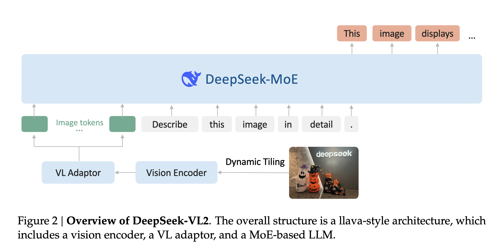
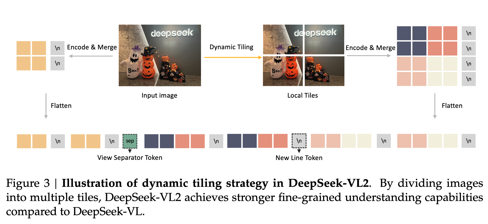

[arXiv](https://arxiv.org/abs/2412.10302) 

DeepSeek presents DeepSeek-VL2, a MOE VLM. It is mostly an incremental improvement over DeepSeek-VL, with a few better design choices inspired by the latest developments in the multimodal space.

    

# Model Architecture

Three components:

- Vision Encoder: SigLIP-SO400M-384
- Vision-Language adaptor: 2-layer MLP
- MoE Language Model: DeepSeek MoE LM
- Three variants with the following model sizes: 1.0B, 2.8B, and 4.5B.

Two major advancements:

- Dynamic tiling strategy
- DeepSeek MoE language model featuring Multi-head Latent Attention

    
