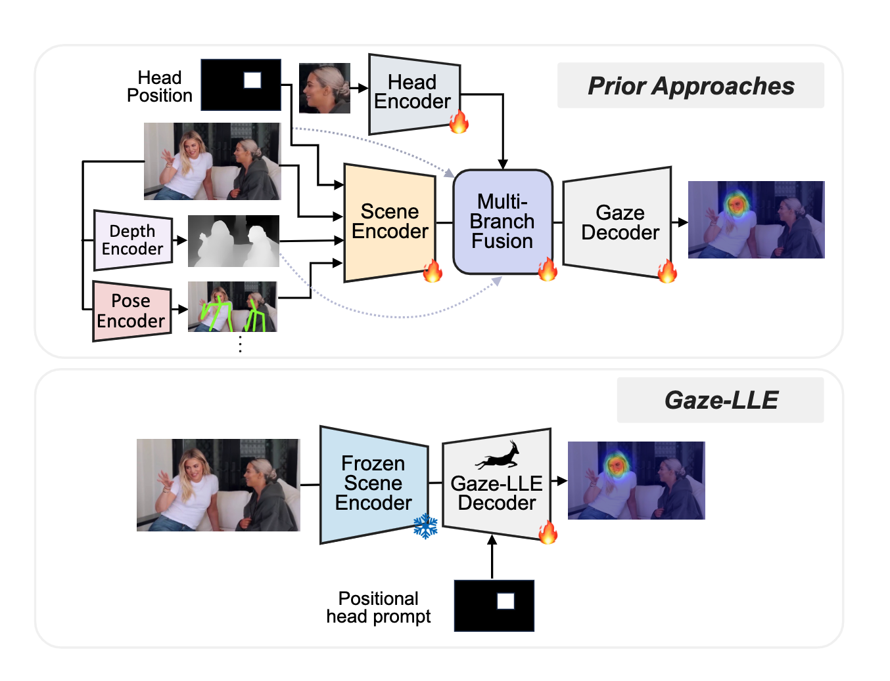
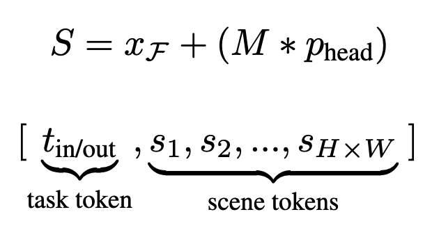
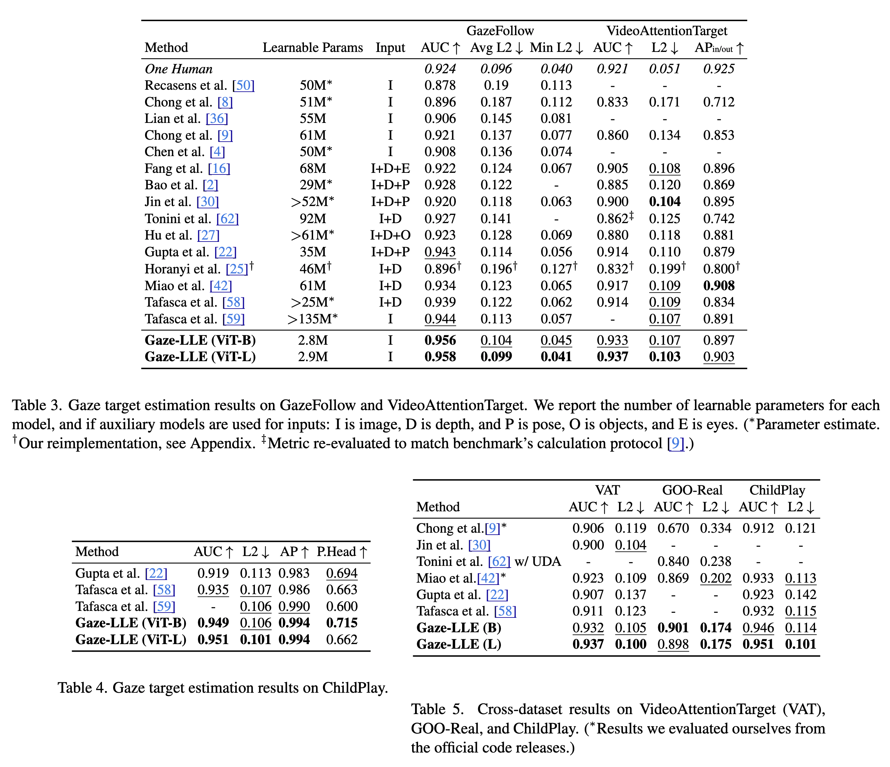

[arXiv](https://arxiv.org/abs/2412.09586) 

What if I tell you you can train a SOTA Gaze estimation model in an hour on an RTX4090 GPU? Too good to be true? I was also skeptical of that claim made in the Gaze-LLE paper, but it is true. **DINOv2 FTW!**

    

# Problem Statement

Given an RGB image and the bounding box for a person's head in the image, predict a heatmap $H ∈ [0, 1]$, where each value represents the probability that the pixel is a gaze target. Optionally, predict $y ∈ [0, 1]$ if the gaze target is inside the frame.

# Model Architecture

- Consists of a scene encoder and a gaze decoder module.
- The scene encoder is frozen, and the decoder is trainable. The gaze decoder performs head prompting to condition outputs on a particular person, updates the feature representation with a small transformer module, predicts a gaze heatmap, and (optionally) if the target is in-frame.
- Though the Gaze-LLE framework is flexible enough to incorporate any feature extractor, the authors use DINOv2 as the scene encoder for extracting features. The feature map obtained $(d_f \times H \times W)$ is then projected using a linear layer to a smaller dimension d_model resulting in a feature map of size $(d_{model} \times H \times W)$.
- The head position is incorporated after the scene encoder. It provides the best performance compared to inserting it before the scene encoder. The authors construct a downsampled, binarized mask $M$ of size $(H \times W)$ from the given head bounding box $x_{bbox}$ within the extracted scene feature map. They also add a learned position embedding to the scene tokens containing the head resulting in a final scene feature map as shown below.

    

- The scene feature maps are then flattened into a list of scene tokens $[s1, s2, ...]$. If the in/out frame prediction is necessary for a person's gaze prediction, a learnable task token $t_{in/out}$, is also prepended to the token list. 2D sinusoidal positional encodings are added to these tokens and are fed into a trainable 3-encoder-layer transformer.

- The output feature map S' from the transformer is reconstructed into a feature map of size (d_model x H x W), which is then passed to the gaze heatmap decoder $D_{hm}$. $D_{hm}$ consists of 2 convolutional layers to upsample the feature map to the output size $(H_{out} \times W_{out})$ and produce a classification score for each pixel as being a gaze target or not. A 2-layer MLP $D_{in/out}$ takes $t_{in/out}$ and outputs a classification score for if the person’s gaze target is in or out of frame.

# Training Objective

- pixel-wise binary cross-entropy for the heatmap
- If gaze in/out of the frame is also to be detected, then a binary cross-entropy loss for the in/out prediction task weighted by $λ$ is also used.

# Results
Here are the results of Gaze-LLE compared to the previous works:

    

# Experimental Details

- Datasets: GazeFollow, VideoAttentionTarget, ChildPlay, and GOO-Rea
- AUCROC metric, pixel $L2$ loss
- DINOv2 with ViT-B and ViTL backbones, patch size=14, $d_{model}=256$, 3 transformer layers with 8 attention heads, and MLP dimension 1024.
- Adam optimizer with $lr=10^{-3}$ and batch_size=60, and 15 epochs
- Random crop, flip, and bounding box jitter as data augmentation and drop path regularization with $p=0.1$
- For VideoAttentionTarget, they fine-tuned it for 8 epochs with lr=1e-2 (in/out params), lr=1e-5 (for other gaze decoder params), and $λ=1$.
- For ChildPlay, they fine-tuned it for 3 epochs with lr=2e-4 and 1e-4 and $λ = 0.1$.
- The model achieves SOTA in less than 1.5 hours on a single RTX4090 GPU

