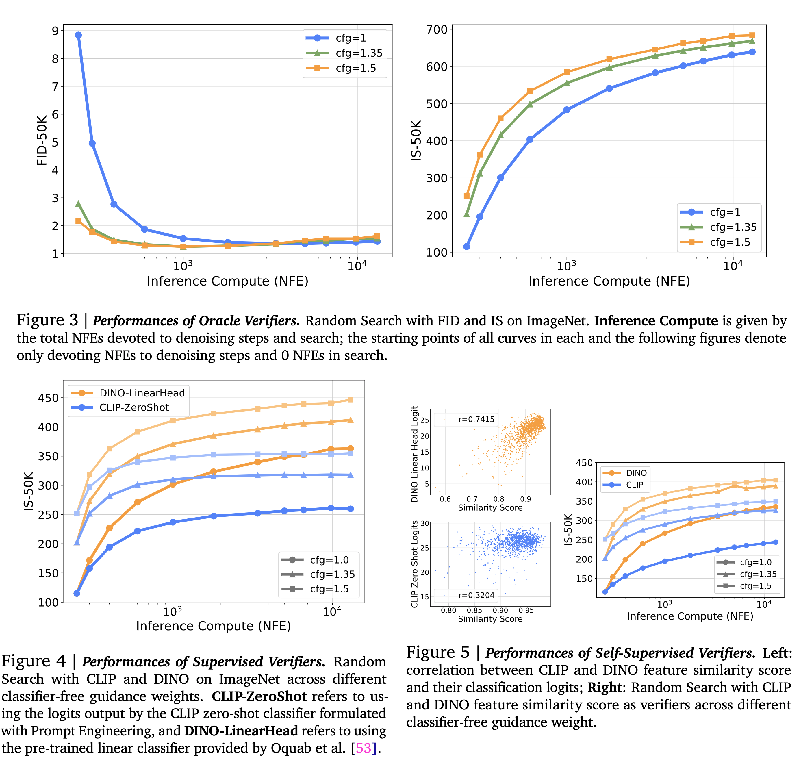
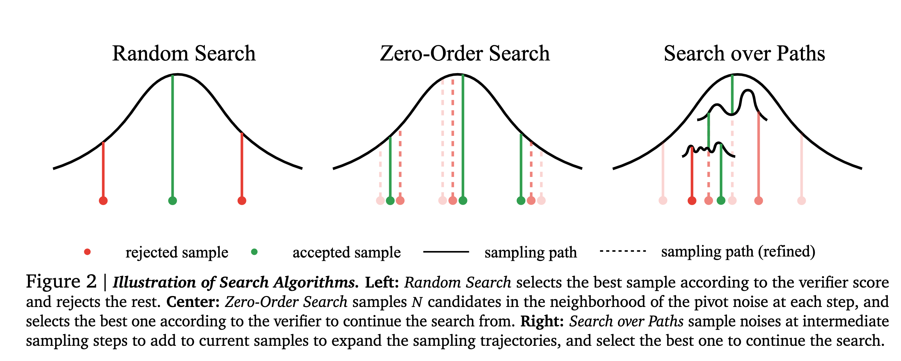
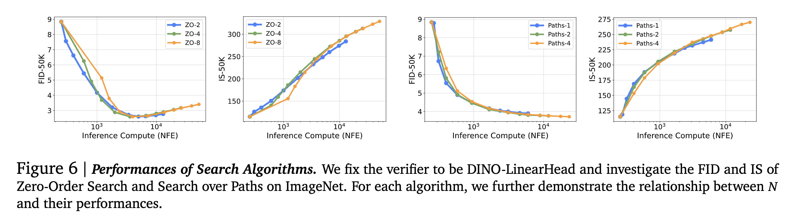
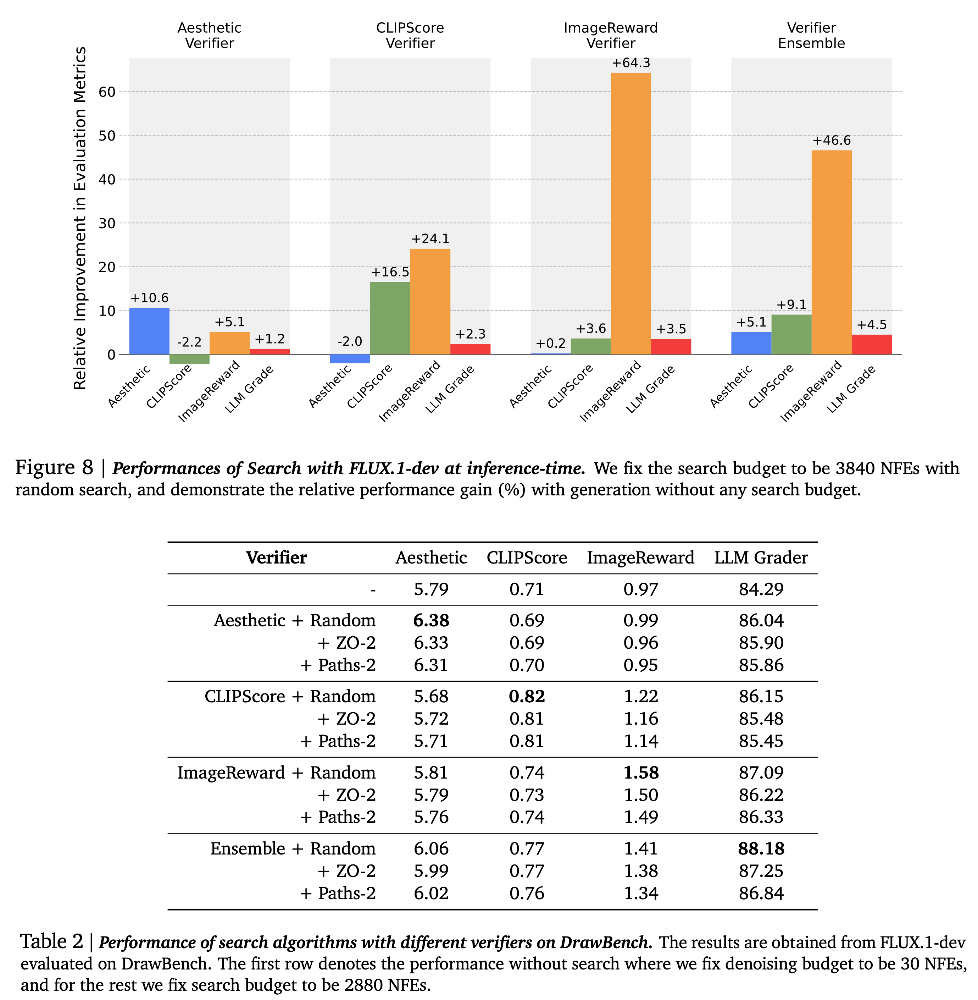
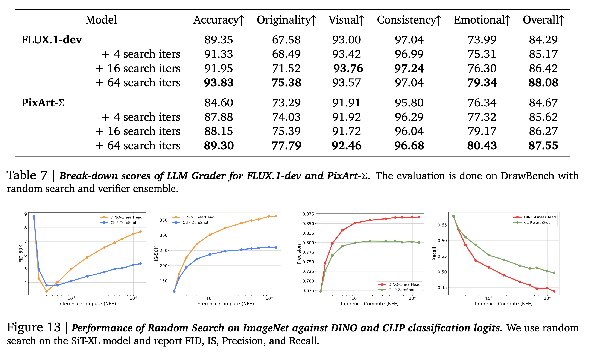

[arXiv](https://arxiv.org/abs/2501.09732) 

Everyone has heard enough about the scaling inference-time compute for LLMs in the past month. Diffusion models, on the other hand, have an innate flexibility for allocating varied compute at inference time. Here is a summary of how researchers at GDM exploit this property:

    

# Motivation

- It has already been proven that different kinds of noise injection lead to various types of sample quality in diffusion models, and the generation quality of these models significantly depends on the noise inversion stability. Hence, searching for better noises during sampling should help.
- More denoising steps produce better sample quality, but only up to a point. Simply scaling inference-time compute for denoising steps is not enough.
-When in doubt, search!

# How to Scale at Inference Time

- The authors treat this as a search problem over the sampling noises and propose two design axes:
  - **Verifiers**: pretrained models used to evaluate the goodness of the candidate. A verifier takes in the generated samples, optionally the corresponding conditions, and outputs a scalar value as the score for each generated sample.

  - **Algorithms**: Used to find better candidates based on the verifier's scores. These functions take the verifier, the diffusion model, and 𝑁 pairs of generated samples with corresponding conditions as inputs and output the best initial noises according to the deterministic mapping between noises and samples.

# Task and design walkthrough

- Class-conditional ImageNet generation.
- SiT-XL model pre-trained on ImageNet with a resolution of 256 × 256.
- Sampling is performed using the second-order Heun sampler.
- The inference-compute budget is the total number of function evaluations (NFEs) used with denoising steps and search cost. The denoising steps are fixed to the optimal setting of 250 NFEs, and the scaling behavior is observed with respect to the NFEs devoted to the search.
- CFG with a weight value of 1.0.
- FID and IS as the evaluation metrics

# Supervised Verifiers

- These evaluate the candidates based on the quality of the samples and their alignment with the specified conditioning inputs.
- Pretrained CLIP and DINO models are used to evaluate the effectiveness of scaling NFEs.
- While searching, the authors run samples through the classifiers and select the ones with the highest logits corresponding to the class labels used in the generation.
- This setup provided a better IS score compared to scaling denoising steps alone.
- A key problem with this setup is the 'Random Search', a Best-of-N strategy applied once on all noise candidates combined with these pretrained verifiers. The logits produced by DINO and CLIP in this setup only focus on the quality of a single sample without considering population diversity. It leads to a significant reduction in sample variance and eventually mode collapse as the compute increases. Random search accelerates the converging of search towards the bias of verifiers.

# Self-supervised Verifiers
- The authors found a strong correlation between the logits output by the DINO / CLIP classifiers and the feature space cosine similarity of the model prediction at a low noise level (𝜎 = 0.4) and the final generated clean sample (𝜎 = 0).
- They use this similarity score as a surrogate for classification logits.
- Verifiers that use this similarity score and do not require additional conditioning information are known as self-supervised verifiers. This is useful for use cases where conditioning information is not available or hard to obtain.

    

# Search Algorithms

The authors use three different search algorithms: Random Search, Zero-Order Search, and Search Over Paths.

    

# Random Search

- The best-of-N strategy was applied once to all noise candidates.
- Randomly sample Gaussian noises, generate samples from them with ODE, and select those corresponding to the best verifier score.
- Since it operates on the entire Gaussian space, it can quickly overfit to the bias of verifiers and lead to failure.

# Zero-Order Search

It leverages verifiers’ feedback to refine candidates iteratively, only slightly each time, thus mitigating the overfitting risks. Here is the algo:

- Start with a random Gaussian noise 𝒏 as a pivot.
- Find 𝑁 candidates in the pivot neighborhood. Formally, the neighborhood is defined as $𝑆^𝜆_𝒏 = { 𝒚:𝑑 (𝒚, 𝒏) = 𝜆}$, where $𝑑 (·, ·)$ is some distance metric.
- Run candidates through an ODE solver to obtain samples and their corresponding verifier scores.
- Find the best candidates, update it to be the pivot, and repeat steps 1-3.

The number of iterations N is the primary scaling axis here. When 𝑁 gets larger, the algorithm will locate a more precise local “optimum”, and when 𝜆 increases, the algorithm will have a larger stride traversing the noise space more quickly. The value of 𝜆  is kept fixed.

# Search Over Paths

Search along the sampling trajectories over the noises injected. Mimics hierarchical search in some sense. Here is the algo:

- Sample 𝑁 initial i.i.d. noises and run the ODE solver until some noise level 𝜎. The noisy samples 𝒙(𝜎) serve as the search starting point.
- Sample 𝑀 i.i.d noises for each noisy sample, and simulate the forward noising process from $𝜎$ to $𝜎 + Δ𝑓$ to produce $𝒙(𝜎+Δ 𝑓)$ with size 𝑀.
- Run ODE solver on each 𝒙(𝜎+Δ 𝑓) to noise level $(𝜎 + Δ 𝑓 − Δ𝑏)$, and obtain $𝒙(𝜎+Δ 𝑓 −Δ𝑏)$. Run verifiers on these samples and keep the top 𝑁 candidates. Repeat steps 2-3 until the ODE solver reaches 𝜎=0.
- Run the remaining 𝑁 samples through the random search and keep the best one.

Termination is guaranteed by keeping Δ𝑏 > Δf. An additional denoising step is done in step 3 before running the sample through the verifier so that the verifier gets a clean image. The primary scaling axis is the number of noises 𝑀 added in step 2. Different values of 𝑁 lead to different scaling behavior. Small 𝑁 is compute efficient in small generation budget, while large 𝑁 have an advantage when scaling up compute more.

    

# Inference-Time Scaling in Text-to-Image

- Datasets: DrawBench and T2I-CompBench. The authors generate two images per prompt and use the 1800 prompts from the validation set for evaluation.
- Models: FLUX.1-dev model
- Verifiers: Four kinds of verifiers were used- Aesthetic Score predictor, CLIPScore, ImageReward, and an ensemble of the three.
- Metrics: Verifiers not included in the search process, and evaluation using Gemini 1.5 Flash from five different perspectives: Accuracy to Prompt, Originality, Visual Quality, Internal Consistency, and Emotional Resonance.

    

# Additional points

- Search can be applied to both pretrained models and fine-tuned models.
- Adjusting NFEs/iter can reveal distinct compute-optimal regions. When NFEs/iter >=50, yield minimal gains despite the additional computational investment.
- With a fixed inference compute budget, performing a search on small models can outperform larger models without search.
- I do not like the use of AestheticsScore in its current state. Why? Aesthetics is a nuanced area. Unless you remove all kinds of biases, all aesthetic scores are meaningless except for sharpness/picture quality.

    
