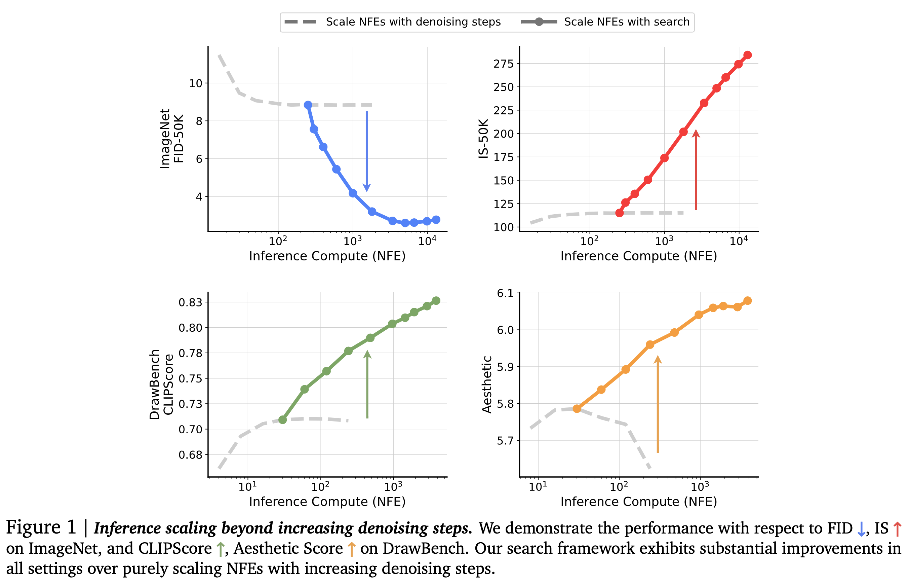

[arXiv](https://arxiv.org/abs/2501.09732) 

Everyone has heard enough about the scaling inference-time compute for LLMs in the past month. Diffusion models, on the other hand, have an innate flexibility for allocating varied compute at inference time. Here is a summary of how researchers at GDM exploit this property:

    

# Motivation

- It has already been proven that different kinds of noise injection lead to various types of sample quality in diffusion models, and the generation quality of these models significantly depends on the noise inversion stability. Hence, searching for better noises during sampling should help.
- More denoising steps produce better sample quality, but only up to a point. Simply scaling inference-time compute for denoising steps is not enough.
-When in doubt, search!

# How to Scale at Inference Time

- The authors treat this as a search problem over the sampling noises and propose two design axes:
  - **Verifiers**: pretrained models used to evaluate the goodness of the candidate. A verifier takes in the generated samples, optionally the corresponding conditions, and outputs a scalar value as the score for each generated sample.

  - **Algorithms**: Used to find better candidates based on the verifier's scores. These functions take the verifier, the diffusion model, and 𝑁 pairs of generated samples with corresponding conditions as inputs and output the best initial noises according to the deterministic mapping between noises and samples.

# Task and design walkthrough

- Class-conditional ImageNet generation.
- SiT-XL model pre-trained on ImageNet with a resolution of 256 × 256.
- Sampling is performed using the second-order Heun sampler.
- The inference-compute budget is the total number of function evaluations (NFEs) used with denoising steps and search cost. The denoising steps are fixed to the optimal setting of 250 NFEs, and the scaling behavior is observed with respect to the NFEs devoted to the search.
- CFG with a weight value of 1.0.
- FID and IS as the evaluation metrics

# Supervised Verifiers

- These evaluate the candidates based on the quality of the samples and their alignment with the specified conditioning inputs.
- Pretrained CLIP and DINO models are used to evaluate the effectiveness of scaling NFEs.
- While searching, the authors run samples through the classifiers and select the ones with the highest logits corresponding to the class labels used in the generation.
- This setup provided a better IS score compared to scaling denoising steps alone.
- A key problem with this setup is the 'Random Search', a Best-of-N strategy applied once on all noise candidates combined with these pretrained verifiers. The logits produced by DINO and CLIP in this setup only focus on the quality of a single sample without considering population diversity. It leads to a significant reduction in sample variance and eventually mode collapse as the compute increases. Random search accelerates the converging of search towards the bias of verifiers.

