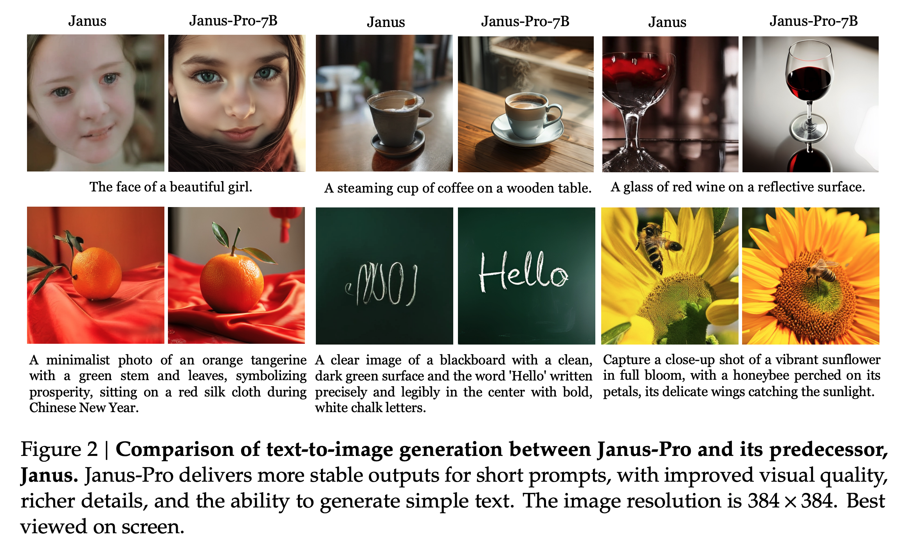
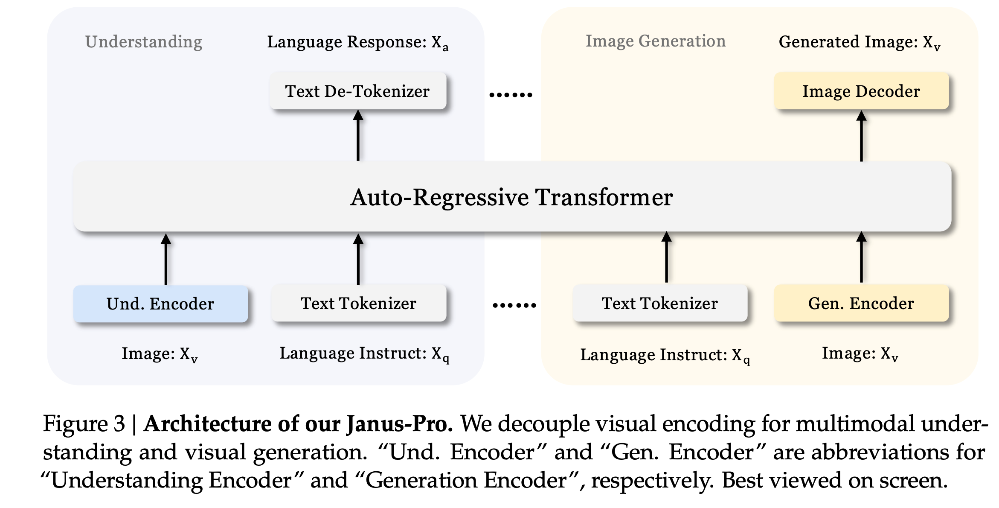

[arXiv](https://arxiv.org/abs/2501.17811) 

JanusPro is here, the next generation of the Janus model, with a few surprises (even for me!). I liked JanusFlow a lot, but the JanusPro 1B is what caught my eye. Here is a summary of the paper:

    

# Architecture

- Same as the previous gen Janus model.
- Decouple visual encoding for multimodal understanding and generation.
- SigLIP encoder as the feature extractor for multimodal understanding. The features are flattened from a 2D grid into a 1D sequence and projected into the LLM space using an adaptor.
- VQ tokenizer to convert images into discrete IDs for visual generation tasks. JanusFlow used rectified flows instead. The ID sequence is flattened to 1D, and a generation adaptor maps the codebook embeddings corresponding to each ID into the input space of the LLM.
- All these feature sequences are then concatenated and fed into an autoregressive model with two prediction heads: one for text generation and the other for visual generation.

    
