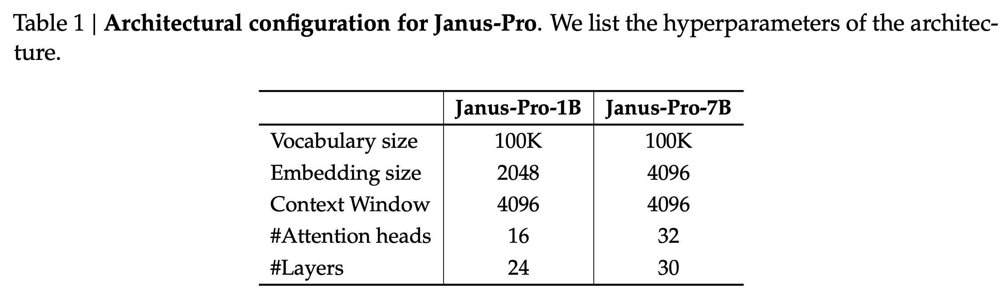

[arXiv](https://arxiv.org/abs/2501.17811) 

JanusPro is here, the next generation of the Janus model, with a few surprises (even for me!). I liked JanusFlow a lot, but the JanusPro 1B is what caught my eye. Here is a summary of the paper:

    

# Architecture

- Same as the previous gen Janus model.
- Decouple visual encoding for multimodal understanding and generation.
- SigLIP encoder as the feature extractor for multimodal understanding. The features are flattened from a 2D grid into a 1D sequence and projected into the LLM space using an adaptor.
- VQ tokenizer to convert images into discrete IDs for visual generation tasks. JanusFlow used rectified flows instead. The ID sequence is flattened to 1D, and a generation adaptor maps the codebook embeddings corresponding to each ID into the input space of the LLM.
- All these feature sequences are then concatenated and fed into an autoregressive model with two prediction heads: one for text generation and the other for visual generation.

    

# Training Strategy Optimization

- Similar to the previous version of Janus, there are three stages of training here, but with some optimizations and subtle differences.
- The length of the training run in stage I, focusing on training the adaptors and the image head, is increased, allowing sufficient training on the ImageNet dataset.
- In stage II, the authors drop the ImageNet data and directly utilize regular text-to-image data to train the model to generate images based on dense descriptions. This resulted in better efficiency and improved performance.
- The data ratio of multimodal data, text data, and text-to-image data in SFT of stage III is also changed from 7:3:10 to 5:1:4.

# Data Scaling for Multimodal Understanding

- 90 million samples in pretraining, including captions data, data for tables, charts, and document understanding.
- For SFT, the authors incorporate additional datasets from DeepSeek-VL2, such as MEME understanding, Chinese conversational data, and datasets to enhance dialogue experiences.

# Data Scaling for Visual Generation

- Noise in real-world datasets leads to instabilities in training text-to-image generation and aesthetically poor outputs.
- To overcome the above, the authors add 72 million samples of synthetic aesthetic data, bringing the ratio of real to synthetic data to 1:1 during the unified pretraining stage.
- Synthetic data helps models converge faster with significantly improved aesthetic quality in the outputs.

# Model Scaling

As expected, when the LLM is scaled up, the convergence speed of losses for both multimodal understanding and visual generation improved significantly compared to the smaller model.

    