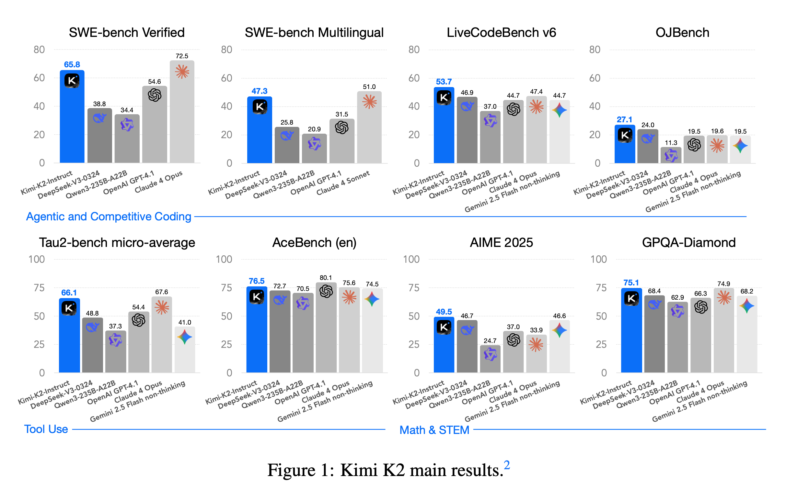
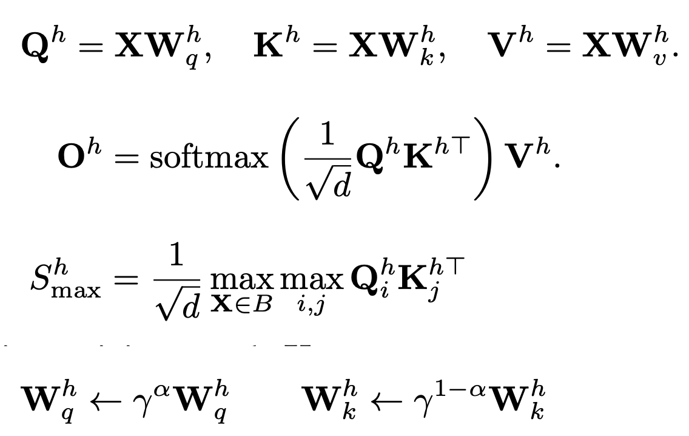
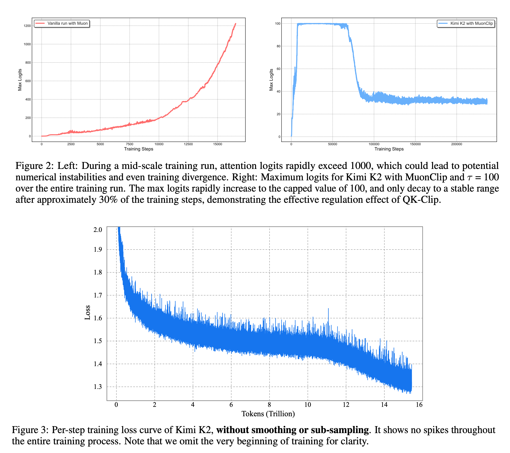
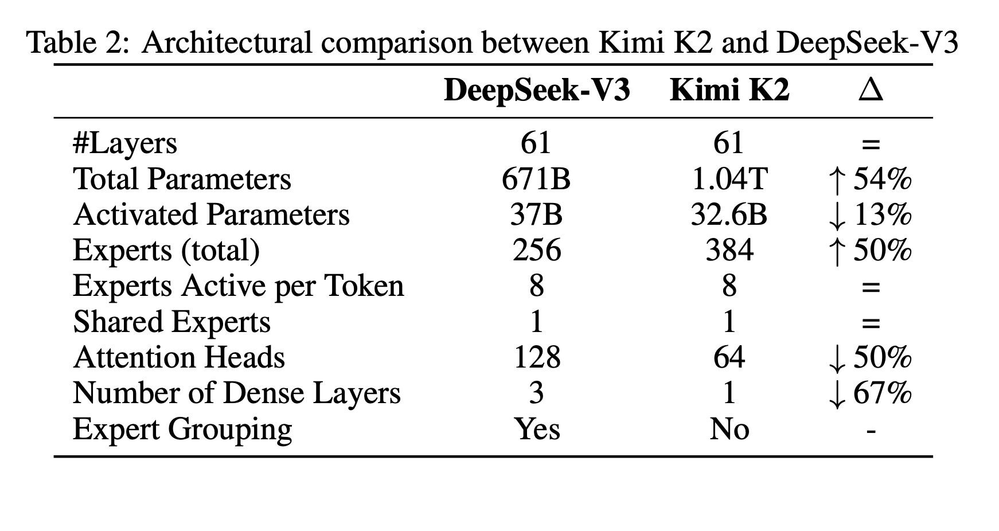
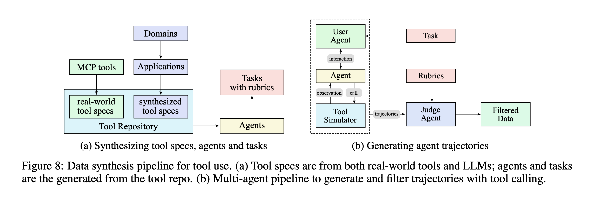
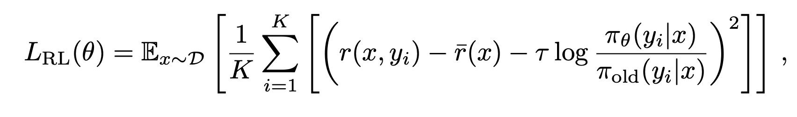

[tech_report](https://github.com/MoonshotAI/Kimi-K2/blob/main/tech_report.pdf) 

# Introduction

- MoE with 32B activate parameters, and 1T total parameters
- Ultra-sparse MoE employed with MLA
- Proposes MuonClip optimizer, an optimizer built on top of Muon leveraging QK clipping
- Pretrained with 15.5T tokens with zero loss spikes
- Multi-stage post-training 
- Introduces a large-scale agentic data synthesis pipeline 
- Proposes a general reinforcement learning framework that combines RLVR with a self- critique rubric reward mechanism. 

  

  

# Pre-training

- Focuses on maximizing per-token efficiency
- The authors find that training instability due to exploding attention logits is more frequent with Muon compared to AdamW
- Since they leverage MLA, QK-Norm cannot be applied
- To address this, they propose Muon with QK-Clip which works by rescaling the query and key projection weights post-update to
bound the growth of attention logits.
- The authors define define a per-head scalar Sh(max), the max logit, as the maximum input to softmax in a given batch. The core idea of QK-Clip is to rescale Wk,Wq whenever Sh(max) exceeds a target threshold τ (=100 in their experiments)     
- Then they integrate Muon with weight decay, consistent RMS matching, and QK-Clip into a single optimizer, MuonClip    

# Pre-training Data: Improving Token Utility with Rephrasing

- Acknowledges the lack of supply of high-quality tokens
- Introduces a synthetic data pipeline to increase token utility. Deployed a rephrasing pipeline is employed to amplify the volume
of high-quality tokens without inducing significant overfitting.
- The rephrasing pipeline consists of three components
  - Style- and perspective-diverse prompting
  - Chunk-wise autoregressive generation
  - Fidelity verification
- The data is rephrased multiple times, and a single epoch training is performed

# Model Architecture

- Similar to DeepSeek-V3
- MoE with 32B activated, and 1.04T total parameters
- They develop a sparsity scaling law tailored for the MoE model family using Muon
- The authors find that increasing sparsity consistently improve model performance
- To balance model performance with cost, they adopt a sparsity of 48, activating 8 out of 384 experts per forward pass.
- They also found that doubling the number of attention heads provides only modest improvement. Hence they keep only 64 attention heads
- 16-way PP, 16-way EP, and Zero-1 were used for parallelism# Model Architecture

 

  

# Training 

- 4096 context window at the start
- The training on the first 10T tokens was done with a constant learning rate of 2e-4 after a 500-step warm-up, followed by 5.5T tokens with a cosine decay from 2e-4 to 2e-5
- Weight decay of 0.1, and a global batch size of 67M tokens
- Long-context activation towards the end of the training. YaRN was used for context extension, and the model was trained on 400 billion tokens with a $4K$ sequence length, followed by an additional 60 billion tokens with a $32K$ sequence length.

# SFT

- Uses simple Muon Optimizer for SFT, and recommends to do the same for any kind of fine-tuning over K2
- Agentic capabilities, especially tool usage at scale is the focus
- Developed a pipeline that simulates real-world tool-use scenarios at scale.
- Three stages in the data synthesis pipeline:
  - Tool spec generation: utilizes both real-word tools, and synthetic tools. 3000 MCP based tools, 20,000 synthetic tools
  - Agent and task generation: For any sampled agentic tool, generate an agent to use the toolset and some corresponding tasks
  - Trajectory generation:For each agent and task generate trajectories where the agent finishes the task by invoking these tools
- Every task completion is rewarded with a rubric that specifies success criteria, expected tool-use patterns, and
evaluation checkpoints
- Hybrid pipeline (LLM based judges + real-execution sandboxes) for filtering and judging completions.

 

  

# RL

- Scale RL in both task diversity and training FLOPs in K2
- The authors develop a Gym-like extensible framework that facilitates RL across a wide range of scenarios
- Combines tasks with verifiable rewards, and other tasks like creative writing with self-critic rewards

# Verifiable Rewards Gym

- Math, STEM and Logical Tasks
- Diverse Coverage: For math and stem tasks, they collect high-quality QA pairs using a combination of expert annotations,
internal QA extraction pipelines, and open datasets. For logical tasks, structured data tasks like tabular reasoning,
and puzzles like Sudoku
- Moderate difficulty: Assuming that RL prompt should neither be too easy nor too difficult. The authors assess the difficulty of each problem using the SFT model’s $pass@k$ accuracy and select only problems with moderate difficulty. 
- Hybrid Rule Verification:
  - Deterministic evaluation via code interpreters for instructions with verifiable outputs
  - LLM-as-judge evaluation for instructions requiring nuanced understanding of constraints.
- Multi-Source Instruction Generation: Three distinct generation strategies
  - expert-crafted complex conditional prompts and rubrics developed by in-house data team
  - agentic instruction augmentation inspired by AutoIF
  - a fine-tuned model specialized for generating additional instructions that probe specific failure modes or edge cases
- For faithfulness evaluation, they train a sentence-level faithfulness judge model to perform automated verification.
- For coding problems, they collect pull requests and issues from GitHub to build software development environment that consists of user prompts/issues and executable unit tests
- For safety they focus on they employ an automated prompt evolution pipeline with three key components: Attack model, target model, and judge model. Each interaction is assessed using a task-specific rubric, enabling the judge model to provide a binary success/failure
label.

# Self-Critique Rubric Reward

- Model evaluates its own outputs to generate preference signals.
- The authors curated a mixture of open-source and in-house preference datasets and initialized K2 critic capability via SFT 
- First the K2 actor generates responses for general prompts that cover a wide range of use cases. The K2 critic then ranks all results by performing pairwise evaluations against a combination of rubrics, including core rubrics, perspective rubrics, and human-annotated rubrics
with the flexibility of letting K2 to provide weightage as suitable
- During RL training, the critic model is refined using verifiable signals, where On-policy rollouts generated from verifiable-reward prompts are used to continuously update the critic
- Same policy optimization as in Kimi-1.5. For each problem $x$, sample $K$ responses from the previous policy $π_{old}$, and optimize the model $π_θ$ with respect to the following objective:    
- To encourage the model to properly distribute inference budget, they enforce a per-sample maximum token budget throughout RL training, where the budget is determined based on the type of task
- To prevent the potential forgetting of valuable, high-quality data during joint RL training, they curate a dataset comprising hand-selected, high-quality samples and integrate it into the RL objective through an auxiliary PTX loss
- During the exploration phase, the temperature is kept high for generation, but they also employ a temperature decay schedule, to shift from exploration to exploitation throughout the training.