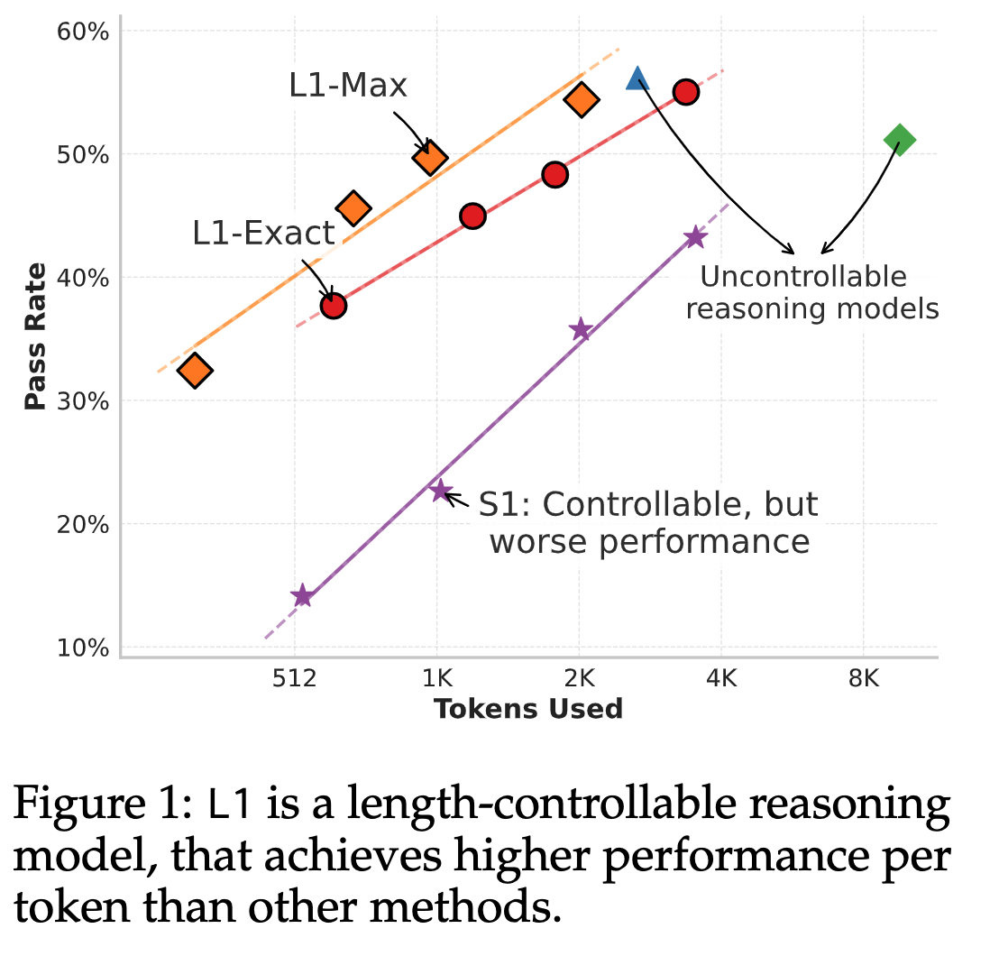

[arXiv](https://arxiv.org/abs/2503.04697) 

Reasoning language models have shown an uncanny ability to improve performance at test-time by “thinking longer”—that is, by generating longer chain-of-thought sequences and hence using more compute. However,
the length of their chain-of-thought reasoning is not controllable, making it impossible to allocate test-time compute to achieve a desired level of performance

What if you want to control the length of CoT sequences? Can you put a budget constraint at test time for the reasoner models while maintaining performance? This latest paper from CMU addresses these two questions via RL. 

    

# Why does it matter?

- Reasoning models improve performance at test time by thinking longer when solving complex problems. Longer thinking means generating an extended chain of thought sequences.
- The inability to control the length of these generated thoughts makes it hard to put a budget constraint to achieve a target-level performance.
- A practical implication of this is on the deployment side. If you have a model tailored to your use case but is not budget-friendly because of high compute, this algorithm gives you a chance to achieve that.

# Length Controlled Policy Optimization (LCPO)

The authors propose an RL-based algorithm LCPO that gives reasoning language models precise and adaptive length control. LCPO trains models to satisfy two objectives. They condition the model on a target token length provided in the prompt.

- Correctness of the final output, and
- Generating reasoning sequences that meet a length constraint specified in the prompt.

# L1-Exact

- Fixed length reasoning trace generation.
- Given an input prompt x and a target length $n_{gold}$, the model is expected to generate a response
$y$ whose length $n_y$ minimizes the absolute difference $|n_{gold} − n_y|$ while simultaneously producing the correct answer
- They start with a Dataset $D = \{(x_i, y_{gold}, i)\}$ consisting of N samples, and a pretrained reasoning model. Each instance in the dataset contains only the input prompt and the final answer with no reasoning traces.
- Each prompt $x_i$ is augmented by appending a target length instruction as shown below: 
$x_i^{new} = \text{Concat}\Bigl(x_i, \text{''Think for } n_{gold,i} \text{ tokens.''}\Bigr),$
- Here $n_{gold, i}$ is sampled uniformly from $Z(n_min, n_max )$. This augmentation yields a new augmented dataset $D_new = \{(x_{new,i}, \ y_{gold}, \ i)\}$
- Then they use GRPO to update the parameters of the model. The reward function combines two terms: a correctness reward r_c and a length penalty r_length. It is defined as: 
$r(y, y_{gold}, n_{gold}) = \mathbb{I}(y = y_{gold}) - \alpha \cdot |n_{gold} - n_y|$
- Here $\mathbb{I}(·)$ is the indicator function, $n_y$ is the generated output length, and α is a scalar responsible for regulating the trade-off between generating the correct answer and meeting the target length. A lower value of α prioritizes correctness, and a higher value of α enforces stricter adherence to the length constraint.
- This objective function not only encourages the model to produce the correct answers with concise reasoning traces when shorter outputs are requested, but also encourages the model to match the prescribed target length even when a correct answer could be generated with fewer tokens.
- At inference, the output length is controlled by selecting a fixed target length $n_{gold}$ (or a set of lengths) that is appended uniformly to every test prompt.
