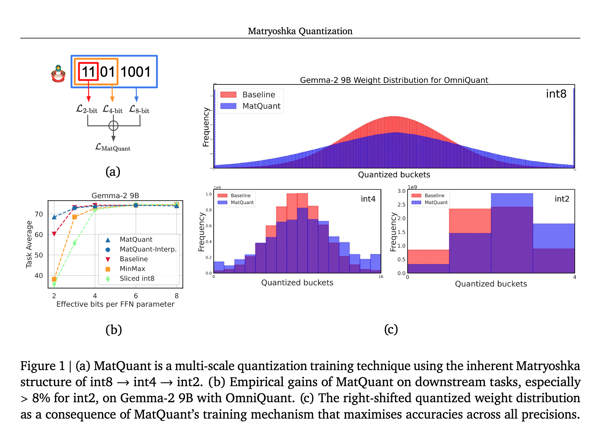
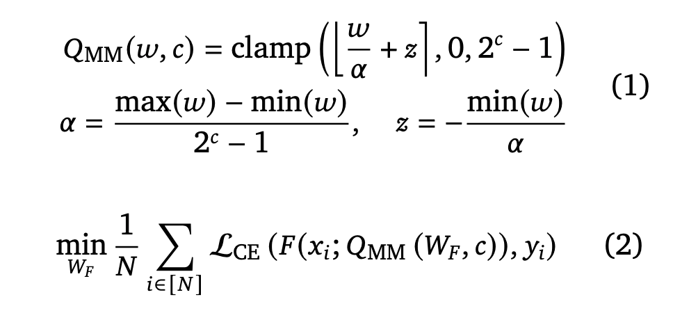
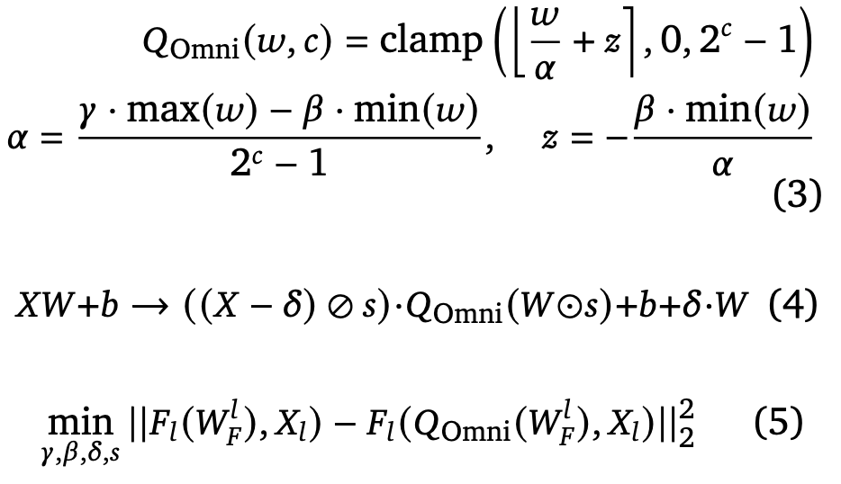
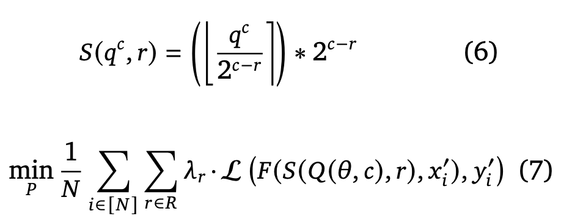

[arXiv](https://arxiv.org/abs/2502.06786) 

Another fantastic paper from GDM! MatQuant came out last week. It was a very refreshing read. 

    

# Introduction

- Quantizing model weights is critical for reducing the communication and inference costs of LLMs.
- Extreme low precisions like int4 or int2 result in severe degradation in the quality of outputs of these models.
- The authors propose Matryoshka Quantization (MatQuant), a novel multi-scale quantization technique that addresses the need for multiple quantized models.
- MatQuant allows training and maintaining just one model that can be served at different precision levels.
- int2 precision models extracted by MatQuant can be up to 10% more accurate than standard int2 quantization.
- It works seamlessly with other quantization techniques like Quantization Aware Training (QAT)and OmniQuant.

# Preliminaries

### 1. Quantized Aware Training

- QAT learns a 𝑐-bit quantized model by optimizing for the end-to-end cross-entropy loss using gradient descent.
- The MinMax quantization of a real-valued vector $𝑤$ in $𝑐$ bits can be formulated as shown below.
$Q(𝑤, 𝑐)$ is the 𝑐-bit quantized version of $𝑤$, $𝛼$ is the scaling factor, and $𝑧$ is the zero point. If W represents weights of a Transformer LLM,  $D = {(𝑥1, 𝑦1), ...., (𝑥𝑁, 𝑦𝑁)}$ a labeled dataset, F the forward pass, $L_{CE}$ the cross-entropy loss, then QAT can be optimized as:

    

### 2. OmniQuant

- Learns scaling and shifting parameters 𝛾 and 𝛽 through gradient descent over layer-wise L2 error reconstruction.
- Like QAT, it uses a straight-through estimator during optimization, but unlike QAT, it operates with limited data, making it much more attractive for resource-scarce settings.
- It adds another set of learnable shifting and scaling parameters to the FFN’s affine projections.
- Mathematically, the MinMax quantization in this case and the corresponding objective function for optimizing OmniQuant are:

    

# Proposed Method: MatQuant

- The idea is to develop a single model that works well at different precisions.
- Leverages the inherent Matryoshka nature of the integer data type, meaning if you want to extract a $𝑟$-bit model from a $𝑐$-bit model $(0 < 𝑟 < 𝑐)$, you can slice out the $𝑟 $most significant bits using a right shift, followed by a left shift of the same order.
- Let $𝑅 = {\{𝑟_1, 𝑟_2, ..., 𝑟_𝐾\}}$ be the bit-widths you want to optimize for, $𝑄(·, )$ represent the quantization function of the base algorithm (i.e., any learning-based quantization scheme), $L (·)$ represent the loss function, $𝐹 (·)$ represent the forward pass, $𝜃$ represent the set of model/auxiliary parameters and let $𝑊_𝐹$ represent the model parameters. The slicing operation and the objective function can mathematically be formulated as shown below
- $𝜆(𝑟)$ is a loss reweighing factor for bit-width. For this paper, three values of $R={\{8, 4, 2\}}$ are used, and a grid search is performed over $𝜆(𝑟)$.

    

# Some observations

- MatQuant alters the quantized weight distributions across precision levels compared to the base quantization algorithm (OmniQuant or QAT).
- Weights quantized with MatQuant tend to use higher-valued weights more. This is beneficial for int2 precision models. (check topmost figure)
- Although MatQuant was trained for three precisions (int8, int4, int2), the resulting model, when quantized to interpolated bit-widths like int6 & int3 by slicing the int8 model, performs on par with a baseline trained explicitly for that precision.
- We can use different precisions at different layers through layer-wise Mix’n’Match for MatQuant models. The authors found that having a higher precision (int8) in the middle layers and a lower precision (int2) at the start and end is Pareto-optimal.
