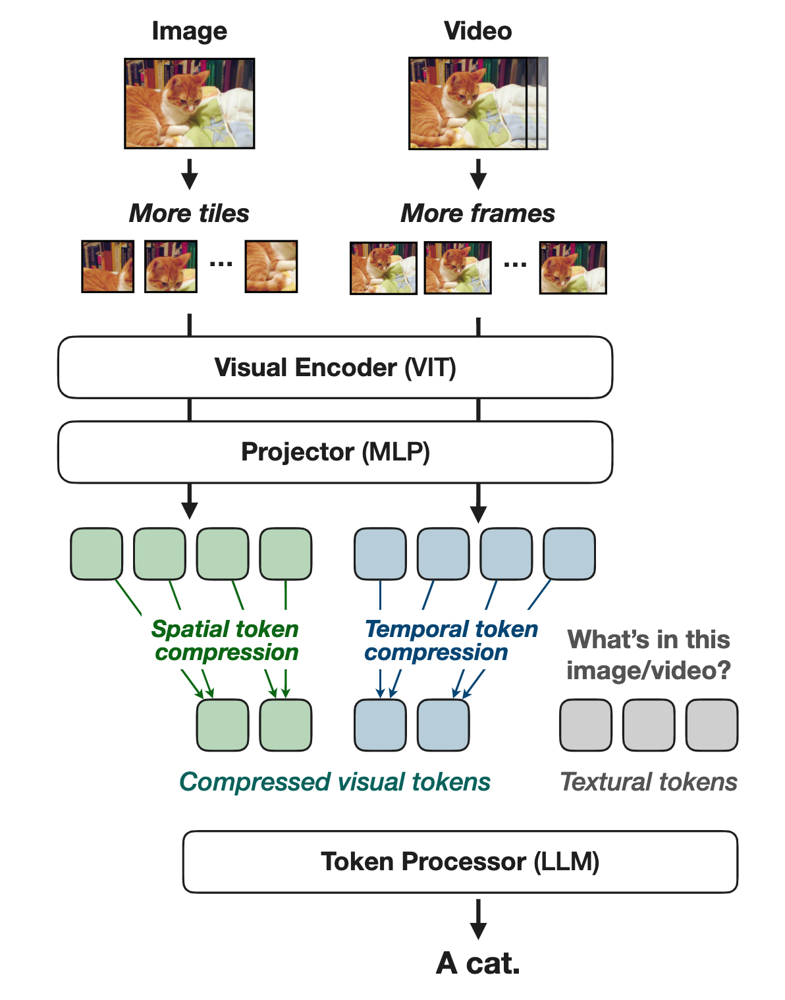
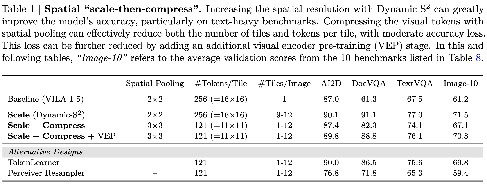

[arXiv](https://arxiv.org/abs/2412.04468) 

Can you pre-train and fine-tune your VLMs in FP8? Can you get more than 2x efficiency with some simple tricks? Nvidia presents NVILA, an efficient frontier VLM that achieves all of the above. I finished reading the paper, and here is a summary in case you are interested:

    

# Efficient Model Architecture

* NVILA is built on top of VILA (as shown above)
* Autoregressive VLM consists of three components:
SigLIP as the visual encoder that extracts features from visual inputs (e.g., images, videos). A two-layer MLP projector that aligns embeddings across visual and language modalities; and Qwen 2 as the token processor that takes visual and language tokens as input, and outputs language tokens.
* The original VILA has very limited spatial and temporal resolutions. It resizes all images to 448×448, regardless of their original size or aspect ratio, and samples up to 14 frames from videos.
* Proposes scale and then compress paradigm for both spatial and temporal tokens to improve accuracy and efficiency.

# Spatial Scale-then-compress

* Inspired by the method proposed in the S^2^ paper that resizes images into a square resolution of the biggest size possible regardless of the original aspect ratio.
* Acknowledges the above resizing is not ideal for all images.
* To address this, the authors propose Dynamic-S^2^, which adaptively processes images with varying aspect ratios.
* Dynamic S^2^ resizes (scales up) to the size that maintains the original aspect ratio and is divisible by 448px tiles. After processing the tiles, the feature maps from all scales are interpolated to match the size of the largest scale and are concatenated.
* Higher resolution helps in increasing the accuracy but the increased resolution with an increased number of tokens increases both training and inference costs by more than 2x, as self-attention scales quadratically with the number of tokens. Hence spatial compression of tokens is required.
* A simple compression (space-to-depth op) with a window size of (2x2) is okay, but a more aggressive token drop leads to a drastic drop in accuracy. The authors hypothesize that more aggressive reductions make the projector significantly harder to train.
* To address this, they propose an additional visual encoder pre-training stage to tune the vision encoder and projectors jointly. This helps recover most of the accuracy loss from spatial token reduction, achieving a 2.4× speedup in training and inference.

    
