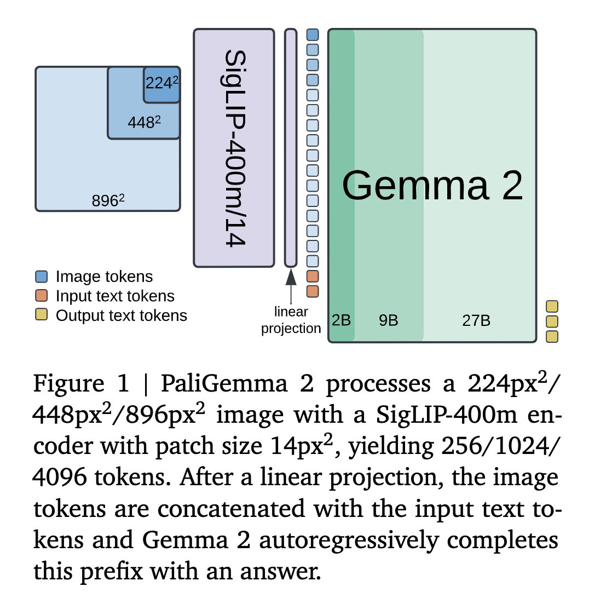
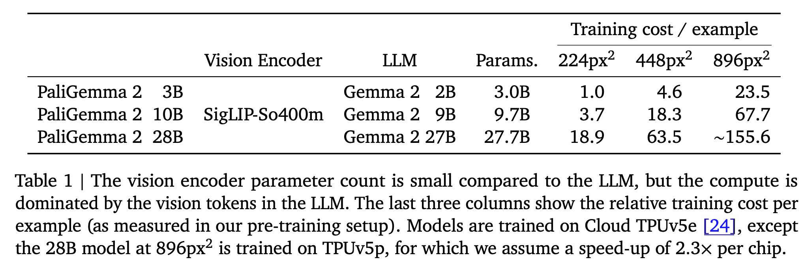
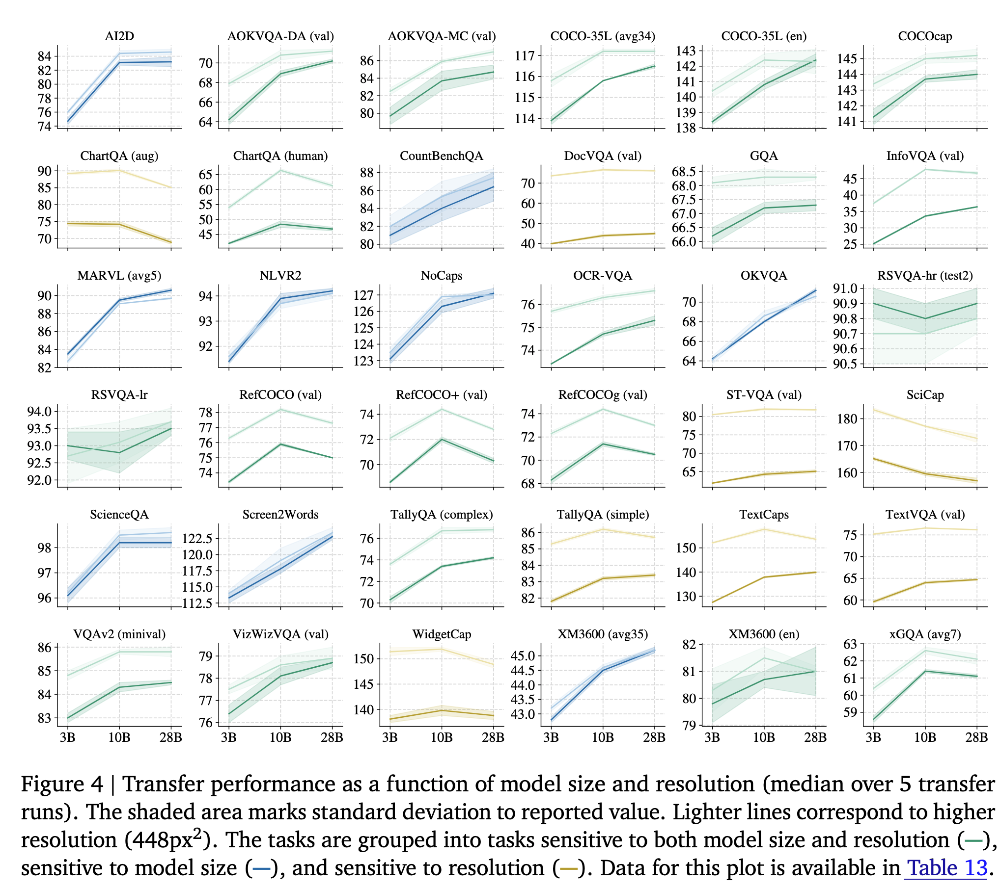
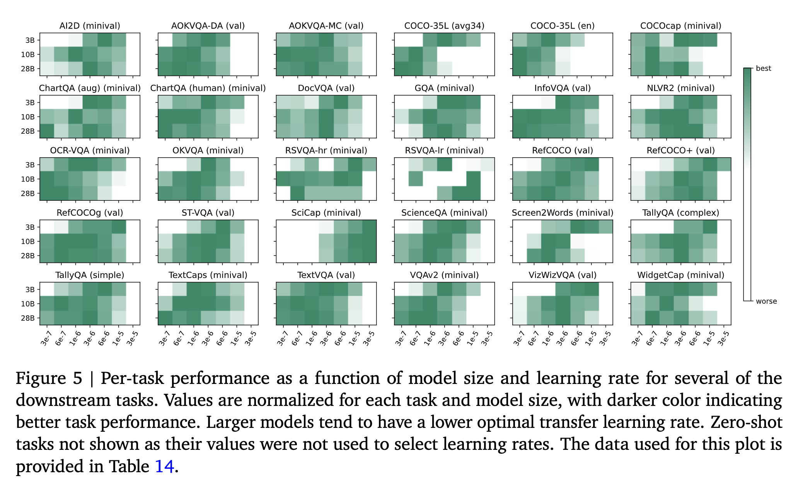
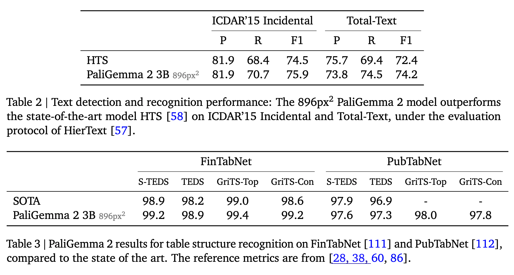
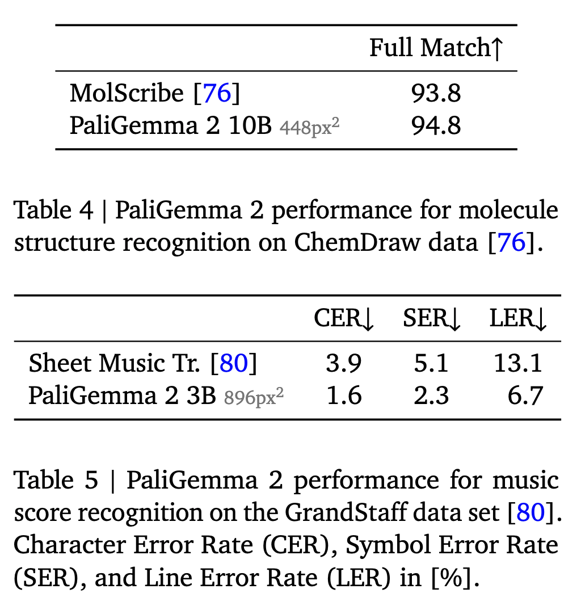
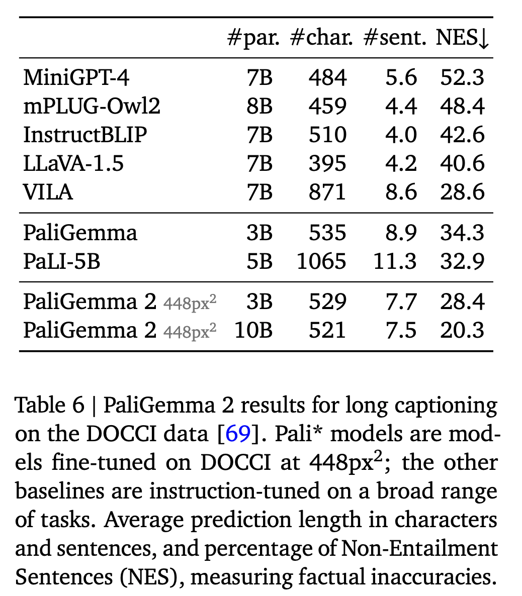
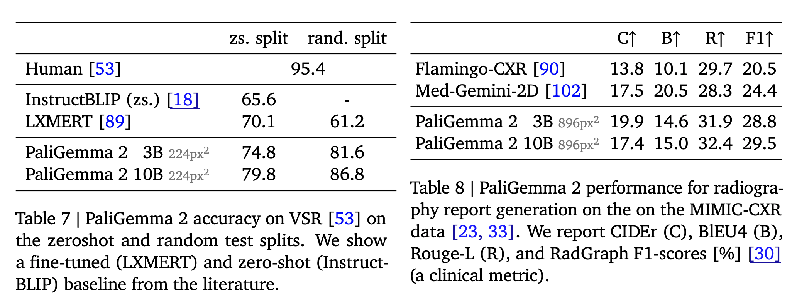

[arXiv](https://arxiv.org/abs/2412.03555) 

Google DeepMind announced PaliGemma 2 last week. It is an upgrade of the PaliGemma open Vision-Language Model (VLM) based on the Gemma 2 family of language models. What does this generation of PaliGemma bring to the table?

    

# Model

* Same modeling, training, and data setup as PaliGemma Pretrained SigLIP-So400m vision encoder.
* The embeddings from the encoder are mapped to the Gemma 2 input space with a linear projection.
* he visual embeddings are combined with a text prompt and fed to the Gemma 2 language model (prefill). Predictions are then obtained by autoregressively sampling from the language model.

    

# Training

Pretraining is done in three stages. Also, unimodal pretraining of individual components (SigLIP and Gemma) is considered stage 0.

* **Stage 1**
  - Combines the pretrained SigLIPSo400m and Gemma 2 raw checkpoints and trains them jointly on a multimodal task mixture of 1 billion examples.
  - 224px image resolution
  - No frozen parameters
* **Stage 2**
  - Two stages
  - Trained on 50 million examples at resolution 448px in the first stage and then 10 million examples at resolution 896px in the second stage.
  - Tasks benefitting from high resolution, e.g., OCR are up-weighted, and the output sequence length is increased. 
* **Stage 3:** The checkpoints from stage 1 or 2 (depending on the resolution) are fine-tuned to the target task.
* If you look closely, you will notice that these stages of training resemble "progressive training" in some way, where the resolution of the images is increased at every stage.
* Logits soft-capping is applied in Stage 1 and Stage 2, but not in Stage 3. It degrades performance in stage 3. Logits soft-capping is applied to the attention and the output logits in the Gemma 2 component with the same parameters used in Gemma models.
* Adam optimizer with default hyperparameters. The learning rate 2e-5 (used in Stage 1 and Stage 2 for PaliGemma) is multiplied by 0.5 for PaliGemma 2 3B and by 0.25 for PaliGemma 2 10B and 28B.

# Data Mixture

* Similar to the mixture used in PaliGemma.
* The mixture involves captioning, grounded captioning, OCR, different machine-generated visual question answering (VQA) tasks, detection, and instance segmentation.

# Effect of Model Size and Image Resolution on Task Performance

* To study this, the authors fine-tuned three model variants (3B, 10B, and 28B) in two resolutions (224px and 448px) on the 30+ academic benchmarks, covering captioning, VQA, segmentation tasks on natural images, documents, infographics, and videos.
* The optimal hparams found in PaliGemma are reused for both the resolutions (224px and 448px), and only the learning rate is swept for {0.03, 0.06, 0.1, 0.3, 0.6, 1.0, 3.0} · 10−5 values.  
* Most tasks see performance gains when increasing the model size and the resolution. There is a group of tasks (yellow markers) focused on text, document, and screen-chart understanding, which mainly benefit from a resolution increase. Other tasks that involve multilingual data or require advanced visual reasoning see performance gains when the size of the LM is increased.
* The authors find that PaliGemma 2 3B generally has a smaller optimal transfer learning rate when compared to PaliGemma. Also, for the same resolution, Gemma 2 performs better than Gemma 1.

    
    

# Benchmarks

* **Text detection and recognition:** The authors fine-tuned PaliGemma 2 on a mixture of the train splits of ICDAR’15, Total-Text, MLT17 and MLT19, HierText, TextOCR, IntelOCR datasets and evaluated it on the ICDAR’15 and Total-Text test sets. PaliGemma 2 3B at 896px outperforms the SOTA HTS.

* **Table structure recognition:** The authors fine-tune the model on (the train splits of) two popular data sets, PubTabNet containing 516k images of tabular data, and FinTabNet consisting of 113k financial report tables from annual reports of S&P 500 companies. PaliGemma 2 sets a new state of the art in most of the metrics used to evaluate these, including TEDS and GRITS.

    

* **Molecular structure recognition:** PaliGemma 2 outperforms the SOTA on MolScribe when using 448px2 resolution

    

* **Generating long, fine-grained captions:** The authors fine-tuned the model on the DOCCI data set that contains 15k images with detailed human-annotated English descriptions with an average length of 7.1 sentences. PaliGemma 2 model produces more factually aligned sentences than many popular VLMs, and increasing model size and resolution improves factual alignment.

    

* **Radiography report generation:** The authors fine-tuned PaliGemma 2 on the MIMICCXR dataset containing 377k images. PaliGemma 2 obtained a SOTA RadGraph score.

    
