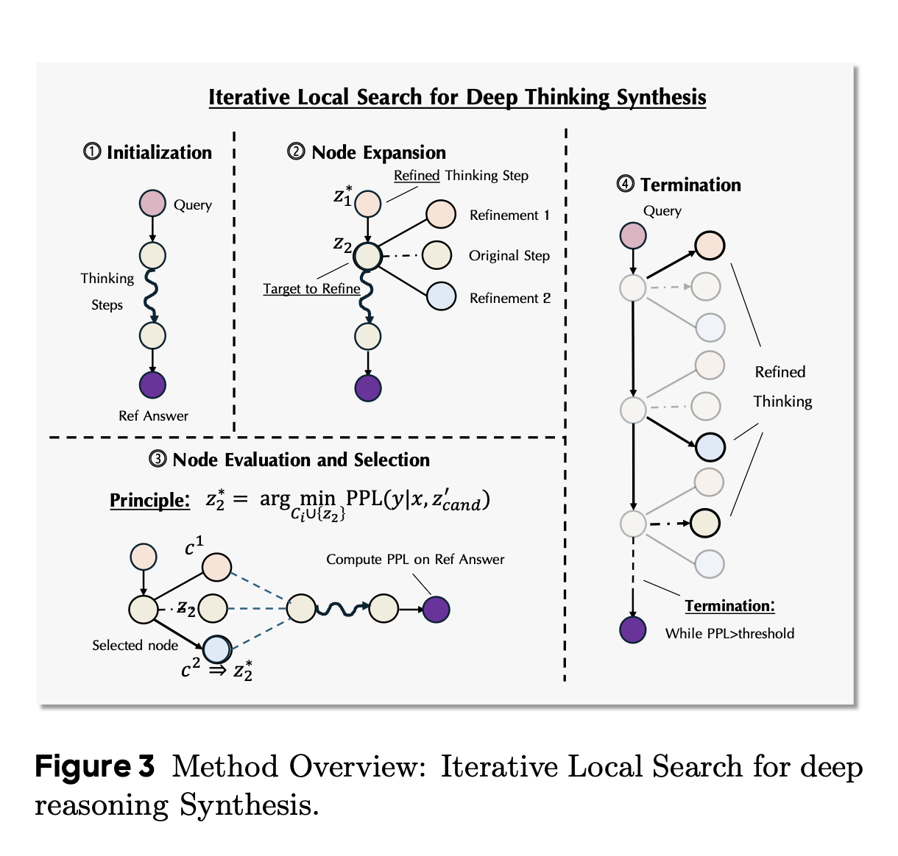
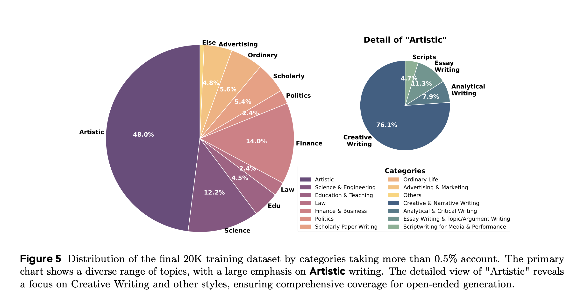
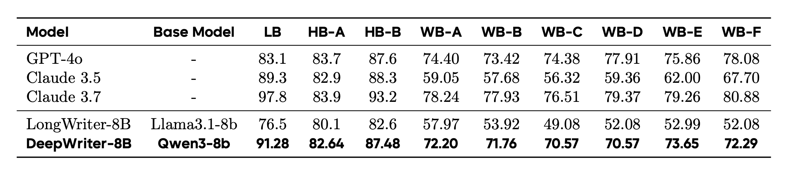
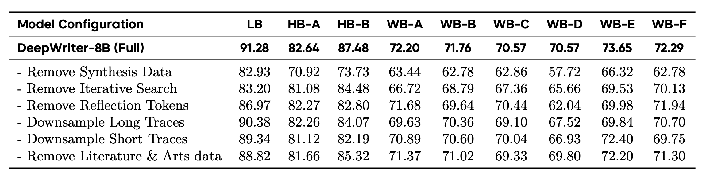

[arXiv](https://arxiv.org/abs/2509.06160) 

# 1. What is it about?

- Reasoning is one of the hottest, if not the hottest, topics in LLMs nowadays. Almost all models are LRMs now.
- RL has predominantly helped unlock these capabilities in the current gen models. There is distillation as well,
but RL has been the primary driver.
- Though it works, but is severely limited by the verifiability. Some domains are easy to verify, example includes
programming, maths (not everything but many things). But there are domains where the reward signal and verifiability are not
straightforward. A typical example of this is creative writing. It is subjective, graded on many aspects like originality, emotional resonance, coherence, etc.
- As a result, implementing deep reasoning for open-ended generation in the absence of task verifiability is an extremely challenging problem to solve. This paper tries to bridge this gap with a simple yet powerful approach

And before you say, "Yeah, but we can still crowd-source it?" Subjective things are extremely nuanced. A good example of this lies in computer vision where capturing aesthetics of a photo is an equivalent problem. Aesthetics of a photo depends on factors like audience, age-groups, demographic opinion, the objects, the background, etc. 

  

  

# 2. Proposal

- Proposes REER to instill deep reasoning capabilities for open-ended generation that shifts the objective from generating a solution to discovering the latent reasoning process.
- Three stage process: Preparing a (synthetic )data of query-solution pairs for open-ended generation, reverse-engineering deep reasoning trajectories without the use of RL or distillation, and fine-tuning a base language model, teaching it to reason and plan deeply before generating a final solution.
- The recovery of high-quality thinking trajectories is done via gradient-free iterative search process
- Based on above, the authors created DeepWriting-20K, a comprehensive dataset of 20,000 thinking trajectories, and
fine-tuned a Qwen3-8B base model

Let us now discuss each of these steps in detail.

## 3.1 REverse-Engineered Reasoning as a Search Problem.

- For an input query x, and y being a high-quality corresponding reference solution, the objective is to find a deep reasoning trajectory, denoted by z, which represents a structured, step-by-step thinking process that guides the generation of $y$ from $x$. 
- Use perplexity of the reference solution y conditioned both on $x$ and $z$ as a proxy for the quality of a given reasoning trajectory $z$.
Lower the perplexity for a given trajectory, better the latent reasoning.
- The reasoning trajectory is then modelled as a discrete sequence of reasoning steps, $z = [z_1, z_2, . . . , z_n]$. The problem is then
formulated as a search problem over all the possible trajectories to find the optimal trajectory.
- This entire optimization is performed via a gradient-free local search algorithm

  

  

## 3.2 Iterative Refinement via Local Search

- *Initialization*: For a given pair (x, y), initialize the first trajectory $z_0 = [z_1, z_2, . . . , z_n]$, by prompting an LLM with a thought-provoking instruction to produce a plausible plan.
- *Segment-wise Refinement*: Refine the segments of the initial trajectory in a loop. At every iteration, pick one segment and prompt the LLM to generate candidate refinements with more thinking-based details, elaborations and reflections. The context to the LLM includes the original query $(x)$, the reference solution $(y)$, refined segments $(z_j)$ \text{where} $j < i$, and unrefined segments $(z_k, \text{where} \ k > i)$. It is ensured that the model does not copy the segments from the reference solution
- *Node evaluation and selection*: For each generated candidate $c$, the authors construct a temporary trajectory $z^`_{cand}$ by substituting $z_i$ with $c$. They then evaluate each candidate by computing its quality score, $S(c) = PPL(y|x, z^′_{cand})$. The candidate with the lowest perplexity score is chosen as the updated segment for the next iteration.

## 3.3 Data Curation

- Need high quality triplets (x, y, z) i.e. (query, response, trajectory)
- Diversity is data is important to avoid overfitting. Data segregated into 25 manually nominated
categories to ensure broad topic coverage. 
- To ensure the generator model performs a true segment-wise edit without including edits for the subsequent parts of the trajectory, tha authors enforce a meta-structure for the reasoning process within the prompt
- Human-alike thinking based tokens like "Hmm, wait..,maybe.." etc. are injected for self-reflection
- Samples where thinking patterns persisted in the final 10% of the sequence were discarded.
- Samples exhibiting high n-gram repetition, a sign of degenerative looping expressions, were filtered out.

# 4. Experimental Setup

- The mixed dataset containing 37,000 samples
- Qwen-3 8B for fine-tuning, and Qwen2.5-32B for trajectory synthesis. Interestingly, all other open models performs worse than Qwen(Go Qwen!)
- Fine-tune for 3 epochs, constant lr=2e-5, and a global batch size of 96. Apparently, no mention of the optimizer used

# 5. Results

  

  

# 6. Interesting findings

- Removing synthetic dataset caused highest degradation in performance
- Removing iterative search also degrades the performance but much lesser than removing the synthetic dataset
- Removing reflection tokens is much more nuanced. Some benchmarks aren't affected that much, while others see significant drop
- Performance degradation after shortening trajectory length is entirely task dependent, much necessary for creative writing though
- Removing literature and arts data degrades performance across all benchmarks
- The fine-tuned model while performing on par with models like GPT-4, and Claude 3.5 beats them in depth of analysis and factual grounding

  

  