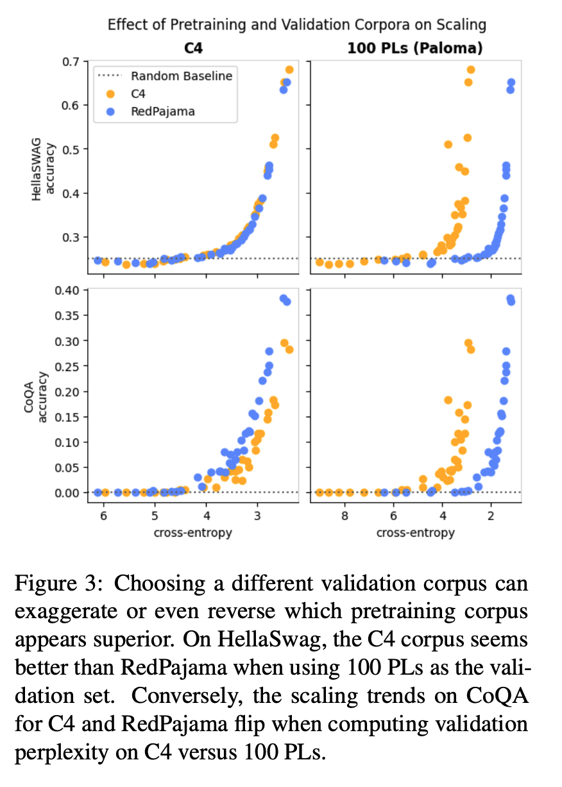
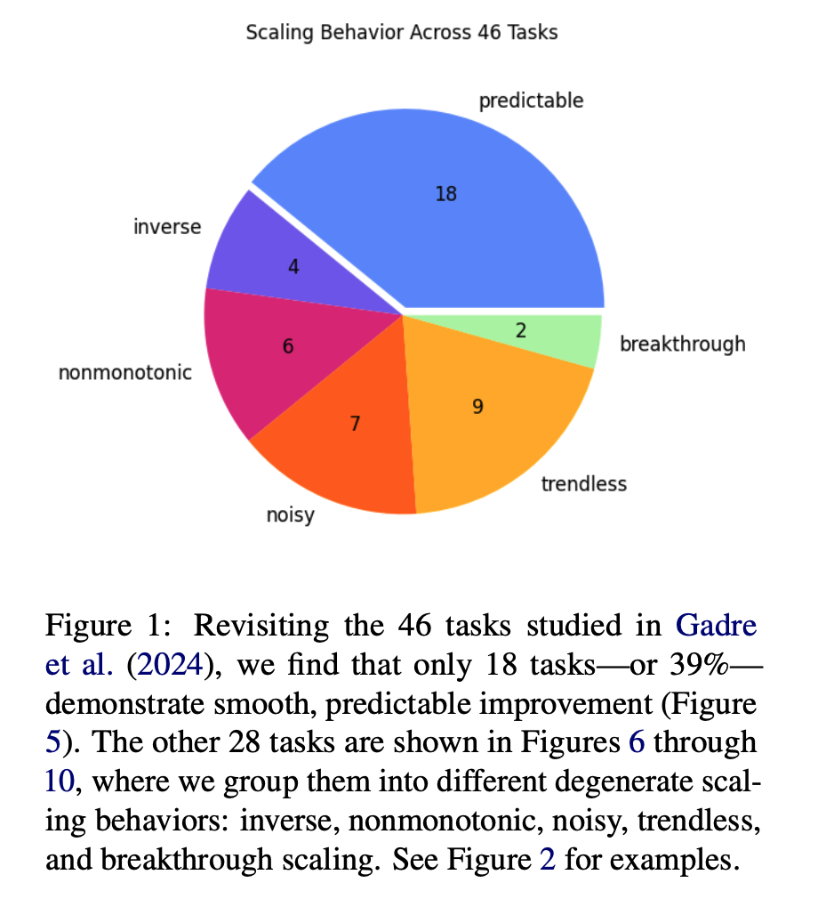
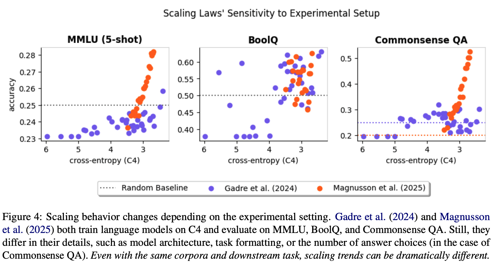

[arXiv](https://arxiv.org/abs/2507.00885) 
[annotated_paper](https://github.com/AakashKumarNain/annotated_research_papers/blob/master/NLP/scaling_laws_for_downstream_tasks.pdf) 

Does a better pretraining loss result in better performance on downstream tasks? Do downstream scaling laws exist? What kind of relationship exists between pretraining loss and performance on downstream tasks? This latest paper from NYU studies the reliability of downstream scaling laws.

  

  

# Introduction

- Scaling laws for language models have been studied in depth and are well-established to an extent. Increasing the size of the model, data, and compute tends to increase the performance of LLMs.
- Though scaling laws give a reliable performance trend for pretraining, better pretraining loss or perplexity does not always translate to better downstream performance.
- As a result, the downstream performance relationship is not always clear, and performance gaps are caused by several issues, with emergent behavior being the most prominent one. 
- The authors identified three major factors that directly affect downstream scaling laws, namely:
    - Datasets used for pretraining and validation,
    - The downstream task, and
    - The experimental setup.
- The authors discovered that changes to any of these factors change the downstream scaling performance, and in some cases, the change can be so drastic that the scaling may no longer be functional.

# Background and Past Works

- Many works have found that downstream scaling laws are more stable when stated in terms of pretraining loss. In particular, two models with different numbers of parameters but the same pretraining loss tend to achieve the same downstream performance.
- In the best-case scenario, downstream task performance is roughly linear in some monotonic transformation of validation loss. For example, y = a exp(c • x) + b, where y is the task performance metric and x is the validation perplexity.
- Cases where we witness emergent behaviors show a structural break, and hence, extrapolation does not work. 

# Scaling Laws Are Specific to the Data  

- Downstream scaling laws are dependent on three factors: 1) pretraining data, 2) validation data, and 3) the downstream task. 
- What validation to choose is use-case dependent, but a necessary evil to compare two models, especially when they are pretrained on different data distributions.
- For the HellaSwag task with C4 as the validation corpus, pretraining on either C4 or RedPajama produces the same scaling law. However, when using 100 Programming Languages as the validation set, pretraining on C4 appears to achieve much better performance, even with a worse validation loss.
- For other tasks like CoQA, RedPajama achieves better performance. Also, changing the validation set from C4 to 100 PLs reverses this relationship. 
- Hence, better perplexity during pretraining may not translate to better downstream task performance, and is dependent on the downstream task, the pretraining corpus, and the validation loss.

  

  

# Irregular Scaling Is Common

- Linear relationships do not capture irregular scaling behaviors like inverse scaling or structural breaks that occur with emergent behaviors.
- How often does linearity hold? To find this out, the authors re-examine scaling behavior on the 46 tasks, classifying them into six categories. 
- They find that linear scaling occurs in a minority of cases in their setting: 39% of the time. For some experimental setups, non-linear scaling is the norm.

  

  

# Scaling Behavior Is Not Always Robust

- Scaling laws may not generalize across settings. Setups with the same validation data and downstream tasks may observe entirely different scaling trends.
- Differences in scaling law behavior may be both quantitative and qualitative. Here is an example showcasing the same:
- There are cases where scaling laws hold and cases where they do not. To some extent, scaling laws are investigator-specific, and so each investigator must verify the scaling law’s presence with visualizations and regression diagnostics.

  

  

# Conclusion

For better downstream task performance, perplexity is not all you need!