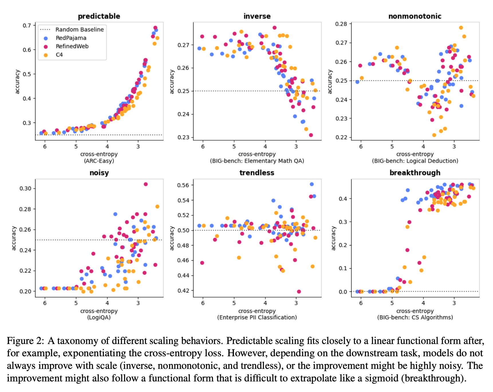

[arXiv](https://arxiv.org/abs/2507.00885) 

Does a better pretraining loss result in better performance on downstream tasks? Do downstream scaling laws exist? What kind of relationship exists between pretraining loss and performance on downstream tasks? This latest paper from NYU studies the reliability of downstream scaling laws.

  

  

# Introduction

- Scaling laws for language models have been studied in depth and are well-established to an extent. Increasing the size of the model, data, and compute tends to increase the performance of LLMs.
- Though scaling laws give a reliable performance trend for pretraining, better pretraining loss or perplexity does not always translate to better downstream performance.
- As a result, the downstream performance relationship is not always clear, and performance gaps are caused by several issues, with emergent behavior being the most prominent one. 
- The authors identified three major factors that directly affect downstream scaling laws, namely:
    - Datasets used for pretraining and validation,
    - The downstream task, and
    - The experimental setup.
- The authors discovered that changes to any of these factors change the downstream scaling performance, and in some cases, the change can be so drastic that the scaling may no longer be functional.