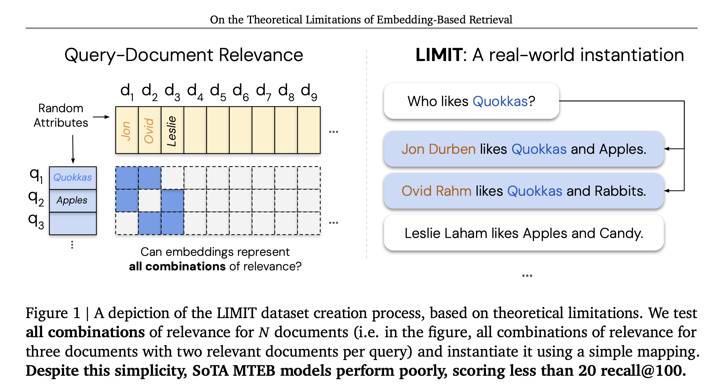
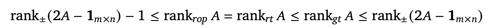
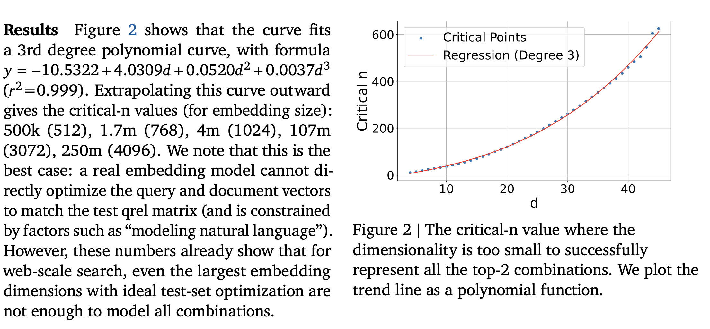
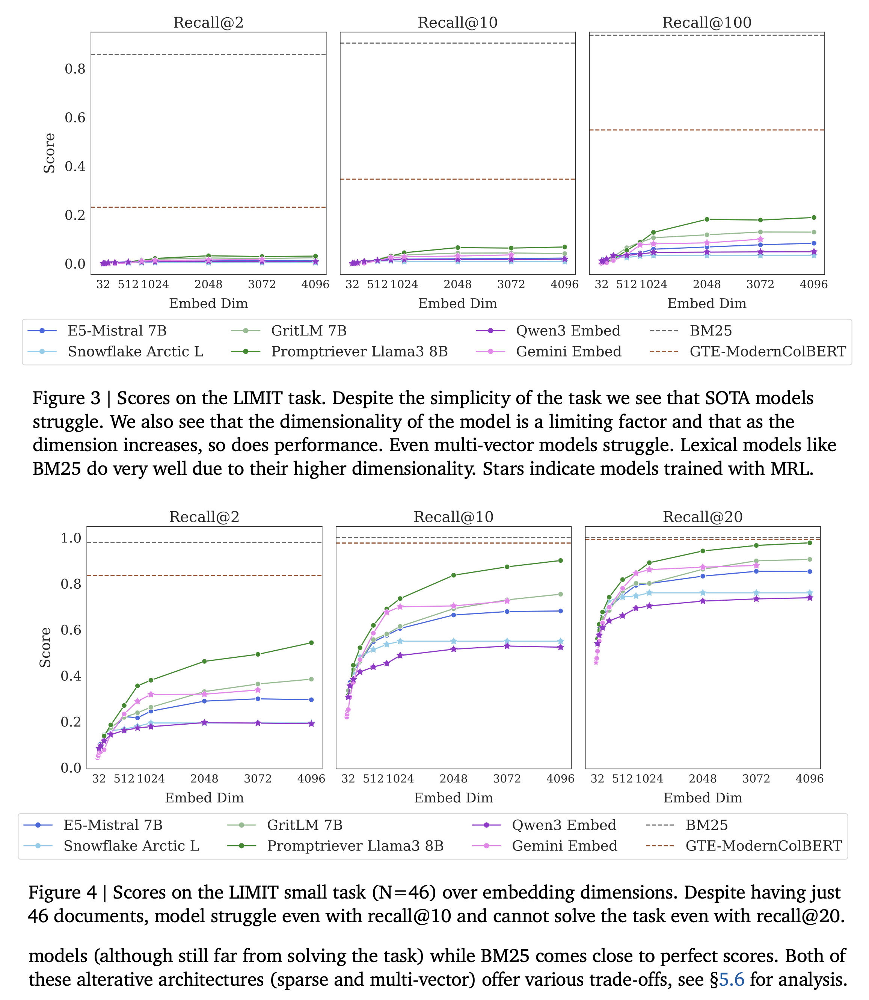

[arXiv](https://arxiv.org/abs/2508.21038) 

# Neural Embedding Models

- Dense retrieval has gained a lot of traction in the past few years. 
- In the era of LLMs, dense retrieval is used for more complicated queries involving conditioning or reasoning.
- The authors focus on finding the limitations of embedding based retrieval by providing a theoretical connection between the embedding dimension
and the sign-rank of the query relevance $(qrel)$ matrix.

 

  

# Representational Capacity of Vector Embeddings

## Formalization
- $m$ queries, $n$ documents with a ground-truth relevance matrix $𝐴 ∈{\{0,1\}}_{𝑚×𝑛}$  where $𝐴_{𝑖𝑗} = 1$ if and only if document $𝑗$ is relevant to query $𝑖$.
- Vector embedding models map each query(i) to a d-dimensional vector $u_i$ and each document to a d-dimensional vector $v_j$.
- Relevance is modeled by the dot product $𝑢^Tv$, with the goal that relevant documents should score higher than irrelevant ones. We represent
the scores all queries corresponding to all documents in a score matrix $B=U^TV$
- The smallest embedding dimension 𝑑 that can realize a given score matrix is the rank of 𝐵. Therefore, finding the minimum rank of a score matrix 𝐵 that correctly orders documents according to the relevance specified in matrix 𝐴

If we consider the relevance matrix A to be a binary matrix for simplicity, then based on the above, we can define the following for finding the theoretical
bounds. Bounds for what? Let us see..

- **row-wise order-preserving rank (rop)**: Given a matrix $𝐴 ∈ ℝ_{𝑚×𝑛}$, the row-wise order-preserving rank of 𝐴 is the smallest integer 𝑑 such that there exists a rank-𝑑 matrix 𝐵 that preserves the relative order of entries in each row of 𝐴.
- **row-wise thresholdable rank (rt)**: minimum rank of a matrix 𝐵 for which there exist row-specific thresholds 𝜏𝑖 such that for all 𝑖, 𝑗, $𝐵_{𝑖𝑗} > 𝜏_𝑖$ if $𝐴_{𝑖𝑗} = 1$ and $𝐵_{𝑖𝑗} < 𝜏_𝑖$ if $𝐴_{𝑖𝑗}$ = 0.
- **globally thresholdable rank (gt)**: the minimum rank of a matrix 𝐵 for which there exists a single threshold 𝜏 above which all entries in A equals to 1 otherwise 0

## Propositions

Based on these definitions, the authors make two propositions.

- Proposition 1: For a binary matrix 𝐴 of size (mxn),  $rank_{rop} 𝐴 = rank_{rt} 𝐴$.
- Proposition 2: If A is a binary matrix, and say $1_{m \times n}$ is a "ones" matrix, then the sandwich inequality shown below holds, where rank
± is sign rank. A sign rank of a matrix $𝑀 ∈\{−1,1\}_{𝑚×𝑛}$ is the smallest integer 𝑑 such that there exists a rank $𝑑$ matrix $𝐵 ∈ℝ_{𝑚×𝑛}$ whose entries have the same sign as those of 𝑀.

 

  

You can prove these literally using pen-paper. But why do we care about these? Well, the authors find a number of consequences:
- It provides a lower and upper bound on the dimension of vectors required to exactly capture a given set of retrieval objectives. Given some binary relevance
matrix 𝐴, we need at least $rank±(2𝐴 − 1_{m \times n})$ − 1 dimensions to capture the relationships in 𝐴 exactly, and can always accomplish this in at most $rank±(2𝐴 − 1_{m \times n})$ dimensions.
- There exists a binary relevance matrix which cannot be captured via 𝑑-dimensional embeddings, meaning no matter how large (but finite) you make your embedding dimension, there are always retrieval tasks too complex to be represented exactly.

# Empirical Connection: Best Case Optimization

- Free embedding optimization as the vectors can be optimized with gradient descent
- Premise: If the free embedding optimization cannot solve the problem, real retrieval models will not be able to either.
- The authors created create a random document matrix (size 𝑛) and a random query matrix of size m with top-𝑘 sets, both with unit vectors
- Adam optimizer, InfoNCE loss function. The number of documents and the queries are increases gradually till they hit the point where no
further improvement is observed. They call this `critical-n` point.
- They use $𝑘= 2$ and increase 𝑛by one for each 𝑑 value until it breaks, and then fit a polynomial regression line to the data

  

  

# Empirical Connection: Real-World Datasets

- Argue that in the existing datasets like QUEST, BrowseComp, etc., the space of queries used for evaluation is a very small sample of the number of potential queries. For example, the number of unique top-20 document sets that could be returned with the QUEST corpus would be 325kC20 which is equal to $7.1e+91$. Thus, the 3k queries in QUEST can only cover an infinitesimally small part of the $qrel$ combination space.
- Proposes the LIMIT Dataset for evaluation. 50K documents, 1000 queries. For each query, they choose to use 𝑘=2 relevant documents both for simplicity in instantiating and to mirror past works
- Though it is hard to find out the hardest $qrel$ matrix using sign rank, they the $qrel$ matrix with the highest number of documents (46 in this case) for which all combinations would be just above 1000 queries for a top-𝑘 of 2. There are two versions: one where each query has 46 relevant documents, and 49.95K non-relevant docs, and the second version with only the 46 documents that are relevant to one of the 1000 queries.
- All sorts of embedding models including Qwen-3, Gemini, Mistral, MRL based, etc.

# Results

- Models struggle even on the small (46 documents in total) version, struggle to reach even 20% $recall@100$ and in the 46 document version models cannot solve the task even with $recall@20$.
- Models trained with diverse instructions do a bit better, but the performance mainly depends on the embedding dimensionality (higher the better).
- The poor performance is not due to domain shift. 

  

  

# What about other kinds of models? Lexical, cross-encoder?

- Sparse models can be thought of as single vector models but with very high dimensionality. This dimensionality helps models like BM25 avoid the problems of the
neural embedding models 
- Multi-vector models are better then other neural models, but they are not widely used on instruction-following or reasoning-based tasks
- Cross-Encoders are expensive but are much better. For example, Gemini reranker can solve all 1000 queries in a single pass. The problem is these kinds of models
can't be used be used for first stage retrieval when there are large numbers of documents.
