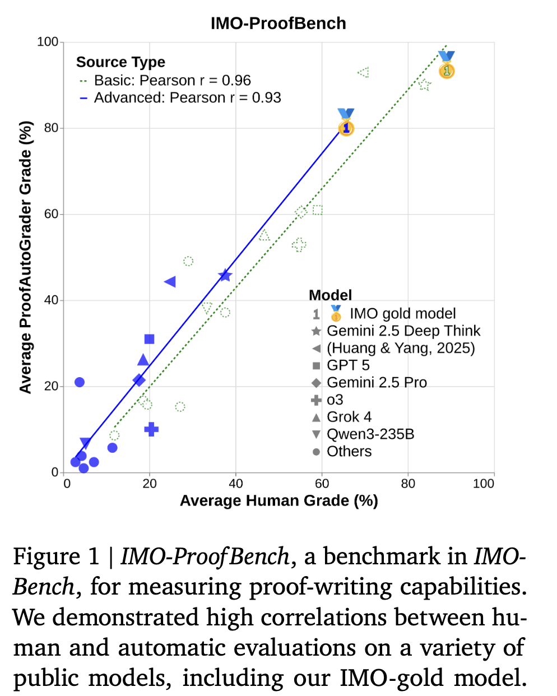
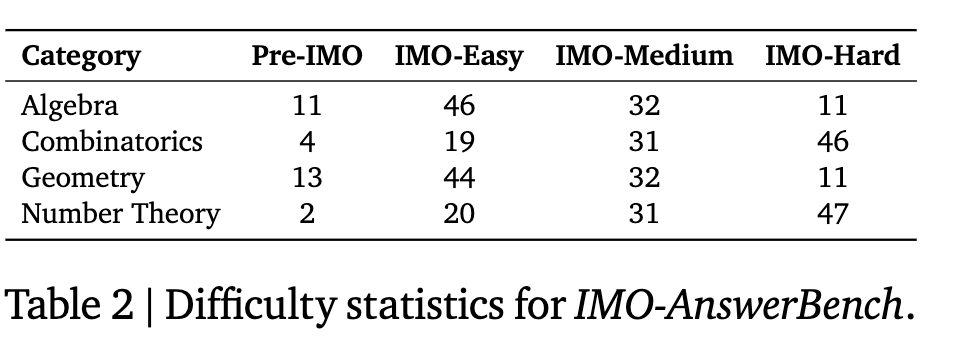
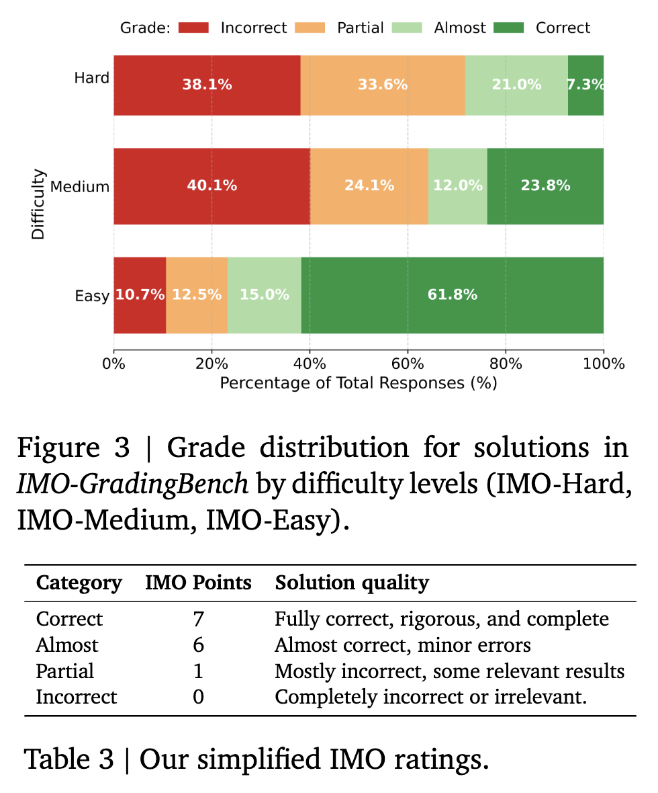
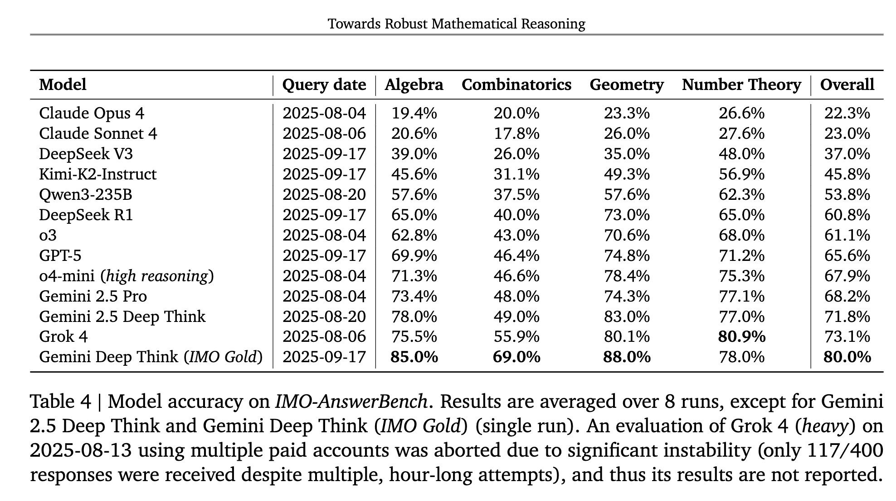

[arXiv](https://arxiv.org/abs/2511.01846v1) 

I just finished reading the latest paper from GDM titled: **Towards Robust Mathematical Reasoning**. This paper isn't about another architectural modification or a new model. Instead, it introduces a new suite of advanced benchmarks to evaluate the reasoning capabilities of LLMs. Here is a summary in case you are interested: 

 

  

Why create a new benchmark? The authors argue that existing benchmarks have major problems. Most benchmarks focus only on the final answer and ignore multi-step reasoning or proof-generation steps. This kind of evaluation can lead to systems that guess answers rather than provide complete proofs. To address these, the authors present IMO-Bench, a suite of advanced reasoning benchmarks vetted
by a panel of top specialists, and that specifically targets the level of the International Mathematical Olympiad (IMO). Here are the benchmarks:

# 1. IMO-AnswerBench

## 1.1 Problem Selection and Robustification

- 400 problems, handpicked from national, regional, and international Olympiad contests, spanning four categories: Algebra, Combinatorics, Geometry, and Number Theory.
- 100 problems for each category with four levels of difficulty: Pre-IMO. IMO-easy, IMO-medium, and IMO-hard.
- All problems in this benchmark include short answers, allowing the correctness of a model's output to be quickly and reliably verified.
- To avoid memorization, they paraphrase problems by changing the names of objects (like point names in geometry problems), rewording questions, or modifying numerical values.

## 1.2 AnswerAutoGrader

General verification of mathematical problems comes with two major issues:

1. We need to ensure that the model outputs are in parsable formats. (If you have used the math_verify package, you know what they are talking about.)
2. Evaluating semantically equivalent but syntactically different expressions. For example, given the ground truth answer"(−∞,−4)∪ (−4,∞)", the answer "all real numbers except -4" should also be graded as correct.

To address these, the authors use an automated verifier "AnswerAutoGrader", which is built by prompting the public Gemini 2.5 Pro model to extract final answers from generated solutions and assess their correctness against ground truths. 

 

  

# 2. IMO-ProofBench

Any system that provides the final correct answer to a problem can still be flawed if the full solution contains flawed reasoning. IMO-ProofBench is designed to evaluate the ability of a model to construct comprehensive and valid mathematical arguments.

## 2.1 Benchmark Setup

- 60 proof-based problems, divided into two sets. The first set contains easy to difficult problems, while the second set contains advanced and highly challenging problems.
- The basic problem set primarily consists of rephrased versions of existing problems. The advanced problem set features 30 problems in the style and difficulty of the IMO. The collection includes 18 novel problems crafted by IMO medalists, alongside 12 problems from recent top-tier competitions: 6 robustified from IMO 2024 and 6 directly from USAMO 2025
- Four grading ratings for evaluation: Correct, Almost, Partial, and Incorrect.
- Human experts are also allowed to assign a score between 0 and 7 for each problem.

## 2.2 Proof AutoGrader

- Automatic evaluation of proofs. Not a complete replacement of human expert evaluators, but more of an experiment.
- The autograder leverages Gemini 2.5 Pro, providing it with a prompt containing the problem statement, the candidate solution, a reference solution, and specific grading guidelines.
- AutoGrader is primarily used for format matching (as expected), and all primary results in this paper are based on expert human evaluation to ensure all results are absolutely correct.

# 3. IMO-GradingBench

- Evaluates the correctness of solutions.
- 1000 examples each containing a problem statement, a proposed solution, and its human-assigned grade on a scale of 0-7.
- Four grades: Correct, Almost, Partial, and Incorrect. To ensure a robust evaluation, the dataset is balanced with a roughly equal number of examples per category.

 

  

# Results

Here are some results demonstrating how the top models perform on IMO-AnswerBench

 

  
